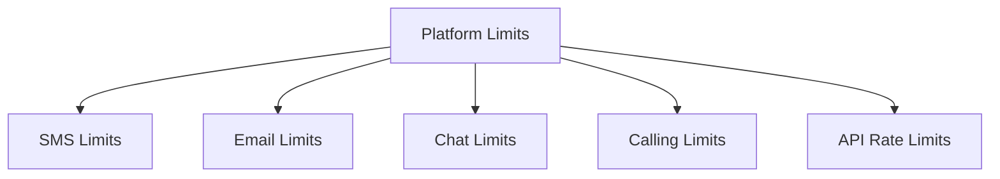

---
content_sources:
  - https://learn.microsoft.com/azure/communication-services/concepts/service-limits
---

# Platform Limits for ACS

Azure Communication Services has built-in limits and quotas for each communication channel to ensure performance and prevent abuse.

<!-- diagram-id: platform-limits-diagram -->

## SMS Limits

| Limit | Description | Value |
| --- | --- | --- |
| Message Size | Maximum characters per SMS message. | 160 (GSM-7) or 70 (UCS-2) |
| Throughput | Messages per second for toll-free numbers. | 1-5 (default) |
| Rate Limit | Maximum SMS requests per second. | 100 per resource |

## Email Limits

| Limit | Description | Value |
| --- | --- | --- |
| Attachment Size | Maximum size of an email attachment. | 25 MB |
| Recipients per Message | Maximum number of recipients (To/Cc/Bcc). | 50 (default) |
| Sending Limit | Emails per hour (for Azure Managed Domain). | 100 (default) |

## Chat Limits

| Limit | Description | Value |
| --- | --- | --- |
| Thread Participants | Maximum participants per chat thread. | 250 |
| Message Size | Maximum size of a chat message. | 28 KB |
| Threads per Resource | Maximum chat threads per resource. | 10,000 (default) |

## Calling Limits

| Limit | Description | Value |
| --- | --- | --- |
| Participants per Call | Maximum participants in a VoIP call. | 350 |
| Recording Limits | Maximum duration of a call recording. | 24 hours |
| Concurrent Calls | Maximum simultaneous calls per resource. | 1,000 (default) |

## API Rate Limits

| Endpoint | Rate Limit |
| --- | --- |
| `/sms` | 100 requests per second. |
| `/email` | 50 requests per second. |
| `/chat` | 200 requests per second. |
| `/identity` | 100 requests per second. |

## See Also
- [Service limits and quotas](https://learn.microsoft.com/azure/communication-services/concepts/service-limits)
- [How to: Request a quota increase](https://learn.microsoft.com/azure/azure-portal/supportability/per-vm-quota-requests)

## Sources
- [ACS Service Limits Reference](https://learn.microsoft.com/azure/communication-services/concepts/service-limits)
