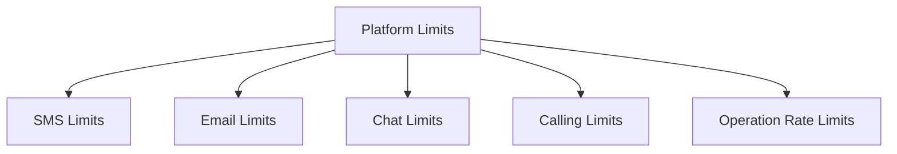

---
content_sources:
  - type: mslearn
    url: https://learn.microsoft.com/azure/communication-services/concepts/service-limits
content_validation:
  status: verified
  last_reviewed: 2026-05-21
  reviewer: agent
  core_claims:
    - claim: "Azure managed email domains are limited to 5 sends per minute and 10 sends per hour per subscription."
      source: https://learn.microsoft.com/azure/communication-services/concepts/service-limits
      verified: true
    - claim: "ACS email total request size, including attachments, is limited to 10 MB unless a support request raises the attachment scenario."
      source: https://learn.microsoft.com/azure/communication-services/concepts/service-limits
      verified: true
    - claim: "ACS chat threads support up to 250 participants and 28 KB messages."
      source: https://learn.microsoft.com/azure/communication-services/concepts/service-limits
      verified: true
    - claim: "ACS voice and video calls support up to 350 participants, and the default outbound PSTN concurrent call limit is 2 per number."
      source: https://learn.microsoft.com/azure/communication-services/concepts/service-limits
      verified: true
---

# Platform Limits for ACS

Azure Communication Services has built-in limits and quotas for each communication channel. Treat this page as a practical summary, and check Microsoft Learn before committing production capacity because service limits can change.

<!-- diagram-id: platform-limits-diagram -->

## SMS Limits

| Operation | Scope | Timeframe | Limit |
| --- | --- | --- | --- |
| Send message from toll-free number | Per number | 60 minutes | 200 requests / 200 message units |
| Send message from short code | Per number | 60 minutes | 6,000 requests / 6,000 message units |
| Send message from alphanumeric sender ID | Per resource | 60 minutes | 600 requests / 600 message units |

Do not document SMS as a generic `100 requests per second` limit. Current limits vary by number type and scope, and Microsoft Learn documents them in per-minute windows.

## Email Limits

| Limit | Scope | Value |
| --- | --- | --- |
| Custom domain send rate | Per subscription | 30 sends/minute and 100 sends/hour by default; higher limits can be requested. |
| Azure managed domain send rate | Per subscription | 5 sends/minute and 10 sends/hour; higher limits are not available. |
| Recipients per email | Per message | 50 recipients. |
| Total email request size | Per message | 10 MB including attachments. Base64 encoding reduces the practical binary attachment size. |
| Authenticated SMTP connections | Per subscription | 250 connections. |
| Domains linked to an ACS resource | Per ACS resource | 100 domains. |

For attachments larger than the 10 MB request limit, Microsoft Learn directs readers to open a support request for up to 30 MB or store larger files in Blob Storage and send a link.

## Chat Limits

| Limit | Description | Value |
| --- | --- | --- |
| Thread Participants | Maximum participants per chat thread. | 250 |
| CreateThread participant batch | Maximum participants in one create-thread request. | 200 |
| AddParticipant participant batch | Maximum participants in one add-participant request. | 200 |
| Message Size | Maximum size of a chat message. | 28 KB |
| ListMessages page size | Maximum messages in one list response. | 200 |
| Send/update/delete message rate | Per chat thread. | 10 requests per 10 seconds / 30 requests per minute |

## Calling Limits

| Limit | Description | Value |
| --- | --- | --- |
| Participants per Call | Maximum participants in a call. | 350 |
| Outbound PSTN Concurrent Calls | Default outbound concurrent calls. | 2 per phone number |
| Inbound PSTN Concurrent Calls | Concurrent inbound calls. | No documented inbound concurrent-call limit |
| Local outgoing streams | Web SDK. | One video or one screen sharing stream |
| Incoming remote streams | Web SDK. | Nine videos plus one screen sharing stream |

## API Rate Limits

Use operation-specific limits instead of invented endpoint-wide limits. Representative examples from Microsoft Learn:

| Capability | Operation | Scope | Limit |
| --- | --- | --- | --- |
| Identity | Create identity | 30 seconds | 1,000 requests |
| Identity | Delete identity | 30 seconds | 500 requests |
| Identity | Issue access token | 30 seconds | 1,000 requests |
| Chat | Create chat thread | Per resource | 3,000 requests per minute |
| Chat | Add participants | Per resource | 3,000 requests per minute |
| Rooms | Create/update/delete room | Per resource | 20 requests per second |
| Job Router | General requests | Per resource | 3,000 requests per 10 seconds |

HTTP 429 means the service throttled the operation. Respect `Retry-After`, reduce request frequency, and request quota increases where Microsoft Learn marks higher limits as available.

## See Also
- [Service limits and quotas](https://learn.microsoft.com/azure/communication-services/concepts/service-limits)
- [How to: Request a quota increase](https://learn.microsoft.com/azure/azure-portal/supportability/per-vm-quota-requests)

## Sources
- [ACS Service Limits Reference](https://learn.microsoft.com/azure/communication-services/concepts/service-limits)
