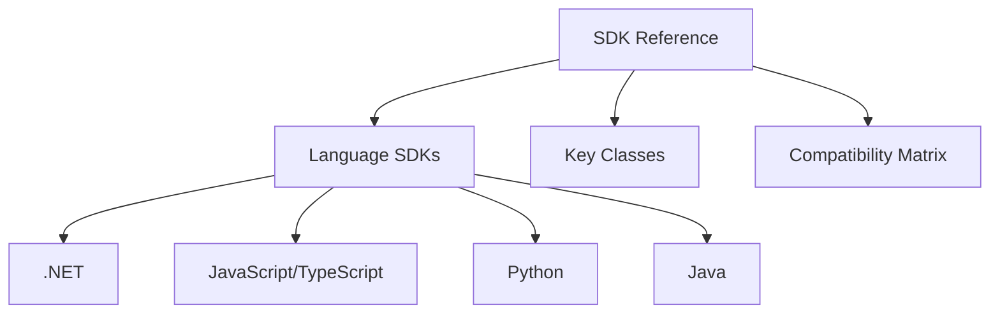

---
content_sources:
  - https://learn.microsoft.com/azure/communication-services/concepts/sdk-overview
content_validation:
  status: pending_review
  last_reviewed: null
  reviewer: agent
  core_claims: []
---

# SDK Reference for ACS

Azure Communication Services (ACS) SDKs are available for multiple programming languages to help you build custom communication solutions.

<!-- diagram-id: sdk-reference-diagram -->

## SDK Package Names and Versions

| Language | Package Name | NuGet/npm/PyPI/Maven | Latest Version (approx) |
| --- | --- | --- | --- |
| **.NET** | `Azure.Communication.Common` | `Azure.Communication.Common` | 1.2.x |
| **JS/TS** | `@azure/communication-common` | `@azure/communication-common` | 1.3.x |
| **Python** | `azure-communication-common` | `azure-communication-common` | 1.1.x |
| **Java** | `azure-communication-common` | `azure-communication-common` | 1.2.x |

## Key Classes and Methods

| Class | Method | Description |
| --- | --- | --- |
| `SmsClient` | `SendSms` / `sendSms` | Sends an SMS message to one or more recipients. |
| `EmailClient` | `SendEmail` / `sendEmail` | Sends an email message with optional attachments. |
| `ChatClient` | `CreateChatThread` / `createChatThread` | Creates a new chat thread between participants. |
| `CallAutomationClient` | `CreateCall` / `createCall` | Creates a new call for voice/video communication. |

## SDK Compatibility Matrix

| Feature | .NET | JS/TS | Python | Java |
| --- | --- | --- | --- | --- |
| SMS | ✅ | ✅ | ✅ | ✅ |
| Email | ✅ | ✅ | ✅ | ✅ |
| Chat | ✅ | ✅ | ✅ | ✅ |
| Calling | ✅ | ✅ | ✅ | ✅ |
| Call Automation | ✅ | ✅ | ✅ | ✅ |

## See Also
- [Azure Communication Services SDK Overview](https://learn.microsoft.com/azure/communication-services/concepts/sdk-overview)
- [How to: Install ACS SDKs](https://learn.microsoft.com/azure/communication-services/quickstarts/create-communication-resource)

## Sources
- [ACS SDK Documentation](https://learn.microsoft.com/azure/communication-services/)
