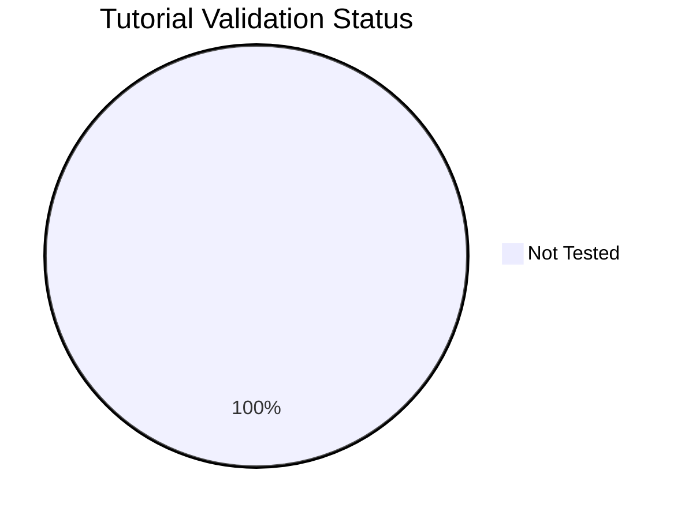

---
content_sources:
  diagrams:
    - id: reference-validation-status
      type: pie
      source: self-generated
      justification: Tutorial validation status chart generated from repository validation frontmatter.
      based_on:
        - docs/sdk-guides/
content_validation:
  status: pending_review
  last_reviewed: null
  reviewer: agent
  core_claims: []
---

# Tutorial Validation Status

This page tracks SDK tutorial validation metadata. `not_tested` means the tutorial is registered in the validation program but has not been executed end-to-end.

## Summary

*Generated from repository frontmatter metadata.*

| Status | Count |
|---|---:|
| Total tutorials | 32 |
| Pass | 0 |
| Fail | 0 |
| Not tested | 32 |
| Missing metadata | 0 |

<!-- diagram-id: reference-validation-status -->


## Validation Matrix

| Tutorial | az_cli | bicep | Overall |
|---|---|---|---|
| [sdk-guides/dotnet/tutorial/01-local-setup.md](../sdk-guides/dotnet/tutorial/01-local-setup.md) | `not_tested` | `not_tested` | `not_tested` |
| [sdk-guides/dotnet/tutorial/02-send-sms.md](../sdk-guides/dotnet/tutorial/02-send-sms.md) | `not_tested` | `not_tested` | `not_tested` |
| [sdk-guides/dotnet/tutorial/03-send-email.md](../sdk-guides/dotnet/tutorial/03-send-email.md) | `not_tested` | `not_tested` | `not_tested` |
| [sdk-guides/dotnet/tutorial/04-chat.md](../sdk-guides/dotnet/tutorial/04-chat.md) | `not_tested` | `not_tested` | `not_tested` |
| [sdk-guides/dotnet/tutorial/05-voice-calling.md](../sdk-guides/dotnet/tutorial/05-voice-calling.md) | `not_tested` | `not_tested` | `not_tested` |
| [sdk-guides/dotnet/tutorial/06-logging-monitoring.md](../sdk-guides/dotnet/tutorial/06-logging-monitoring.md) | `not_tested` | `not_tested` | `not_tested` |
| [sdk-guides/dotnet/tutorial/07-infrastructure-as-code.md](../sdk-guides/dotnet/tutorial/07-infrastructure-as-code.md) | `not_tested` | `not_tested` | `not_tested` |
| [sdk-guides/dotnet/tutorial/index.md](../sdk-guides/dotnet/tutorial/index.md) | `not_tested` | `not_tested` | `not_tested` |
| [sdk-guides/java/tutorial/01-local-setup.md](../sdk-guides/java/tutorial/01-local-setup.md) | `not_tested` | `not_tested` | `not_tested` |
| [sdk-guides/java/tutorial/02-send-sms.md](../sdk-guides/java/tutorial/02-send-sms.md) | `not_tested` | `not_tested` | `not_tested` |
| [sdk-guides/java/tutorial/03-send-email.md](../sdk-guides/java/tutorial/03-send-email.md) | `not_tested` | `not_tested` | `not_tested` |
| [sdk-guides/java/tutorial/04-chat.md](../sdk-guides/java/tutorial/04-chat.md) | `not_tested` | `not_tested` | `not_tested` |
| [sdk-guides/java/tutorial/05-voice-calling.md](../sdk-guides/java/tutorial/05-voice-calling.md) | `not_tested` | `not_tested` | `not_tested` |
| [sdk-guides/java/tutorial/06-logging-monitoring.md](../sdk-guides/java/tutorial/06-logging-monitoring.md) | `not_tested` | `not_tested` | `not_tested` |
| [sdk-guides/java/tutorial/07-infrastructure-as-code.md](../sdk-guides/java/tutorial/07-infrastructure-as-code.md) | `not_tested` | `not_tested` | `not_tested` |
| [sdk-guides/java/tutorial/index.md](../sdk-guides/java/tutorial/index.md) | `not_tested` | `not_tested` | `not_tested` |
| [sdk-guides/javascript/tutorial/01-local-setup.md](../sdk-guides/javascript/tutorial/01-local-setup.md) | `not_tested` | `not_tested` | `not_tested` |
| [sdk-guides/javascript/tutorial/02-send-sms.md](../sdk-guides/javascript/tutorial/02-send-sms.md) | `not_tested` | `not_tested` | `not_tested` |
| [sdk-guides/javascript/tutorial/03-send-email.md](../sdk-guides/javascript/tutorial/03-send-email.md) | `not_tested` | `not_tested` | `not_tested` |
| [sdk-guides/javascript/tutorial/04-chat.md](../sdk-guides/javascript/tutorial/04-chat.md) | `not_tested` | `not_tested` | `not_tested` |
| [sdk-guides/javascript/tutorial/05-video-calling.md](../sdk-guides/javascript/tutorial/05-video-calling.md) | `not_tested` | `not_tested` | `not_tested` |
| [sdk-guides/javascript/tutorial/06-logging-monitoring.md](../sdk-guides/javascript/tutorial/06-logging-monitoring.md) | `not_tested` | `not_tested` | `not_tested` |
| [sdk-guides/javascript/tutorial/07-infrastructure-as-code.md](../sdk-guides/javascript/tutorial/07-infrastructure-as-code.md) | `not_tested` | `not_tested` | `not_tested` |
| [sdk-guides/javascript/tutorial/index.md](../sdk-guides/javascript/tutorial/index.md) | `not_tested` | `not_tested` | `not_tested` |
| [sdk-guides/python/tutorial/01-local-setup.md](../sdk-guides/python/tutorial/01-local-setup.md) | `not_tested` | `not_tested` | `not_tested` |
| [sdk-guides/python/tutorial/02-send-sms.md](../sdk-guides/python/tutorial/02-send-sms.md) | `not_tested` | `not_tested` | `not_tested` |
| [sdk-guides/python/tutorial/03-send-email.md](../sdk-guides/python/tutorial/03-send-email.md) | `not_tested` | `not_tested` | `not_tested` |
| [sdk-guides/python/tutorial/04-chat.md](../sdk-guides/python/tutorial/04-chat.md) | `not_tested` | `not_tested` | `not_tested` |
| [sdk-guides/python/tutorial/05-voice-calling.md](../sdk-guides/python/tutorial/05-voice-calling.md) | `not_tested` | `not_tested` | `not_tested` |
| [sdk-guides/python/tutorial/06-logging-monitoring.md](../sdk-guides/python/tutorial/06-logging-monitoring.md) | `not_tested` | `not_tested` | `not_tested` |
| [sdk-guides/python/tutorial/07-infrastructure-as-code.md](../sdk-guides/python/tutorial/07-infrastructure-as-code.md) | `not_tested` | `not_tested` | `not_tested` |
| [sdk-guides/python/tutorial/index.md](../sdk-guides/python/tutorial/index.md) | `not_tested` | `not_tested` | `not_tested` |

## How to Update

Only set `result: pass` after executing the tutorial against a real Azure environment. Use `not_tested` when the tutorial is registered but not yet executed.

```bash
python3 scripts/generate_validation_status.py
```

## See Also

- [SDK Guides](../sdk-guides/index.md)
- [Content Source Validation Status](content-validation-status.md)
- [CLI Cheatsheet](cli-cheatsheet.md)

## Sources

- [Azure Communication Services documentation](https://learn.microsoft.com/azure/communication-services/)
