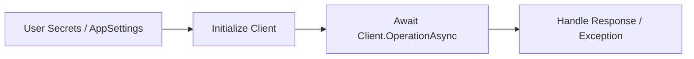

# .NET SDK Guide

The Azure Communication Services (ACS) .NET SDK allows developers to integrate SMS, email, chat, and voice calling into their C# applications. It follows the standard Azure SDK for .NET patterns, including support for dependency injection and asynchronous operations.

## NuGet Packages

The .NET SDK is modular. You only need to include the specific packages for the features you use.

| Feature | NuGet Package |
| --- | --- |
| **Identity** | `Azure.Communication.Identity` |
| **SMS** | `Azure.Communication.Sms` |
| **Email** | `Azure.Communication.Email` |
| **Chat** | `Azure.Communication.Chat` |
| **Phone Numbers** | `Azure.Communication.PhoneNumbers` |
| **Call Automation** | `Azure.Communication.CallAutomation` |

## Prerequisites

- .NET 6.0 or later.
- dotnet CLI or Visual Studio.
- An active Azure subscription and an ACS resource.

## Quick Start: Send SMS

```csharp
using Azure.Communication.Sms;

string connectionString = Environment.GetEnvironmentVariable("COMMUNICATION_SERVICES_CONNECTION_STRING");
SmsClient smsClient = new SmsClient(connectionString);

SmsSendResult result = await smsClient.SendAsync(
    from: "<your-acs-number>",
    to: "<recipient-number>",
    message: "Hello from .NET!"
);

Console.WriteLine($"Message sent with ID: {result.MessageId}");
```

## SDK Workflow

The .NET SDK is designed for modern C# development, featuring `Async` methods and `Response<T>` wrappers.

<!-- diagram-id: dotnet-sdk-workflow -->


## Next Steps

- **[Tutorial](./tutorial/index.md)**: A complete guide to building a communication-enabled application.
- **[Recipes](./recipes/index.md)**: Snippets for specific common tasks and configurations.

## Sources
- [Azure Communication Services .NET SDK Reference](https://learn.microsoft.com/dotnet/api/overview/azure/communication-services)
- [NuGet Gallery](https://www.nuget.org/)
