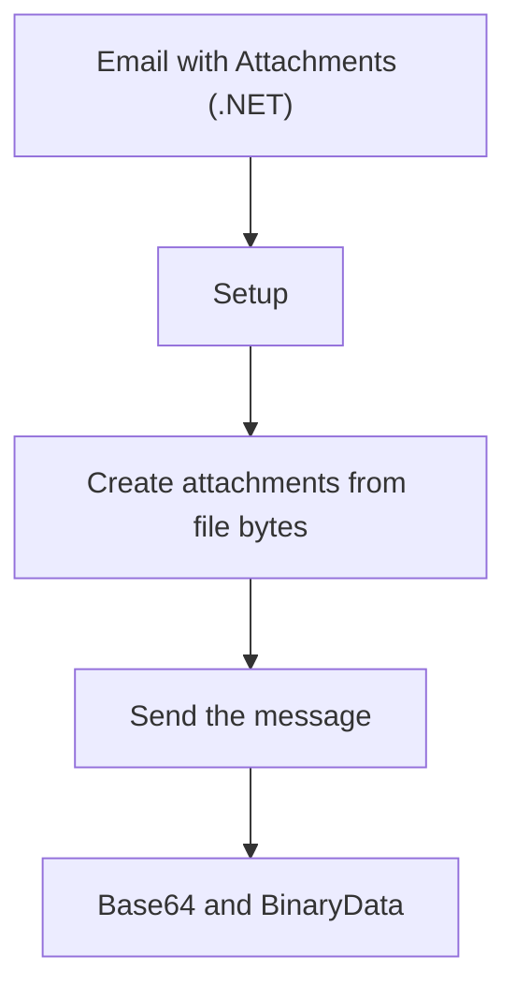

# Email with Attachments (.NET)

Use ACS Email when you need to send reports, invoices, or diagnostic bundles from an app or worker.

!!! note "Attachment limits"
    Keep each attachment under **10 MB** and send no more than **10 attachments** per email.

## Setup

```csharp
using Azure.Communication.Email;

var client = new EmailClient(Environment.GetEnvironmentVariable("ACS_EMAIL_CONNECTION_STRING"));
```

## Create attachments from file bytes

```csharp
using Azure;
using Azure.Communication.Email;

var pdfBytes = await File.ReadAllBytesAsync("invoice.pdf");
var pngBytes = await File.ReadAllBytesAsync("chart.png");

var attachments = new List<EmailAttachment>
{
    new EmailAttachment("invoice.pdf", "application/pdf", BinaryData.FromBytes(pdfBytes)),
    new EmailAttachment("chart.png", "image/png", BinaryData.FromBytes(pngBytes)),
    new EmailAttachment("summary.csv", "text/csv", BinaryData.FromBytes(await File.ReadAllBytesAsync("summary.csv")))
};
```

## Send the message

```csharp
var message = new EmailMessage(
    senderAddress: "DoNotReply@contoso.com",
    recipientAddresses: new[] { "user@contoso.com" },
    content: new EmailContent("Monthly package")
    {
        PlainText = "Attached are the invoice and supporting files.",
        Html = "<p>Attached are the invoice and supporting files.</p>"
    });

message.Attachments.AddRange(attachments);

var response = await client.SendAsync(WaitUntil.Completed, message);
Console.WriteLine($"Message id: {response.Value.MessageId}");
```

## Base64 and BinaryData

When a workflow needs a base64 string first, convert the raw bytes yourself and still pass `BinaryData` to ACS.

```csharp
var base64 = Convert.ToBase64String(pdfBytes);
Console.WriteLine(base64[..24] + "...");
```

## Multiple attachment types

| Type | Example |
| --- | --- |
| `application/pdf` | Invoice |
| `image/png` | Screenshot |
| `text/csv` | Export |
| `application/zip` | Archive |

## Practical guidance

!!! tip "Prefer links for large payloads"
    If the payload approaches the size limit, upload it to Blob Storage and include a SAS link instead.

## Full example

```csharp
using Azure;
using Azure.Communication.Email;

var client = new EmailClient(Environment.GetEnvironmentVariable("ACS_EMAIL_CONNECTION_STRING"));

var attachments = new List<EmailAttachment>
{
    new("invoice.pdf", "application/pdf", BinaryData.FromBytes(await File.ReadAllBytesAsync("invoice.pdf"))),
    new("summary.csv", "text/csv", BinaryData.FromBytes(await File.ReadAllBytesAsync("summary.csv")))
};

var message = new EmailMessage("DoNotReply@contoso.com", new[] { "user@contoso.com" },
    new EmailContent("Invoice attached")
    {
        PlainText = "Invoice and summary are attached.",
        Html = "<p>Invoice and summary are attached.</p>"
    });

message.Attachments.AddRange(attachments);

await client.SendAsync(WaitUntil.Completed, message);
```

## Page Flow

<!-- diagram-id: email-with-attachments-page-flow -->


## See Also

- [Email quickstart](../index.md)
- [Email with attachments (Java)](../../java/recipes/email-with-attachments.md)

## Sources

- https://learn.microsoft.com/azure/communication-services/quickstarts/email/send-email-advanced/send-email-with-attachments
- https://learn.microsoft.com/en-us/azure/communication-services/quickstarts/email/send-email-advanced/send-email-with-attachments
