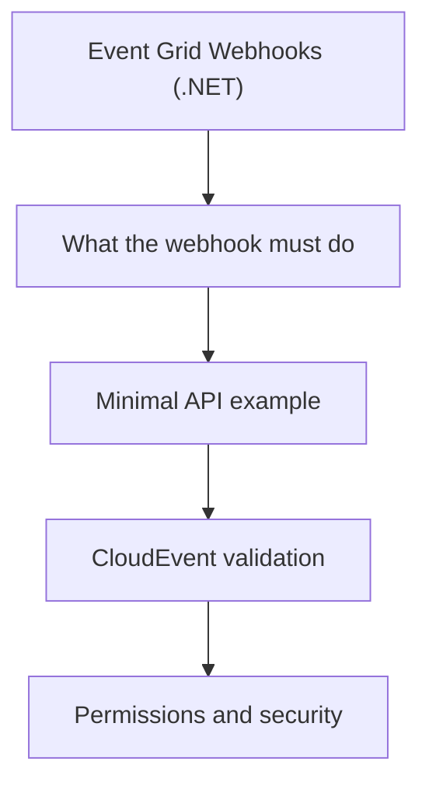

# Event Grid Webhooks (.NET)

Use an ASP.NET Core endpoint when ACS needs to publish SMS, email, chat, or call events to your app.

## What the webhook must do

| Requirement | Why it matters |
| --- | --- |
| Validate subscription handshake | Event Grid sends a validation request first |
| Accept CloudEvents | ACS publishes in CloudEvents format |
| Return `200 OK` quickly | Prevent Event Grid retries |
| Idempotent handling | Duplicate deliveries can occur |

## Minimal API example

```csharp
using System.Text.Json;
using Azure.Messaging;

var builder = WebApplication.CreateBuilder(args);
var app = builder.Build();

app.MapPost("/api/events", async (HttpRequest request) =>
{
    var events = await JsonSerializer.DeserializeAsync<JsonElement[]>(request.Body);
    if (events is null || events.Length == 0)
    {
        return Results.BadRequest();
    }

    foreach (var evt in events)
    {
        var type = evt.GetProperty("type").GetString();

        if (type == "Microsoft.EventGrid.SubscriptionValidationEvent")
        {
            var data = evt.GetProperty("data");
            var code = data.GetProperty("validationCode").GetString();
            return Results.Ok(new { validationResponse = code });
        }

        if (type == "Microsoft.Communication.SMSReceived")
        {
            Console.WriteLine($"SMS from {evt.GetProperty("data").GetProperty("from").GetString()}");
        }
        else if (type == "Microsoft.Communication.EmailDeliveryReportReceived")
        {
            Console.WriteLine($"Email status: {evt.GetProperty("data").GetProperty("status").GetString()}");
        }
        else if (type == "Microsoft.Communication.ChatMessageReceived")
        {
            Console.WriteLine($"Chat message event id: {evt.GetProperty("id").GetString()}");
        }
        else
        {
            Console.WriteLine($"Ignored event type: {type}");
        }
    }

    return Results.Ok();
});

app.Run();
```

## CloudEvent validation

When you validate incoming events, check:

- `specversion` is `1.0`
- `type` matches a supported ACS event
- `source` points to the ACS resource
- `data` contains the expected schema

## Permissions and security

!!! warning "Do not trust the webhook blindly"
    Validate your endpoint with HTTPS, restrict public access if possible, and verify that the payload matches the ACS event contract.

For production, place the webhook behind Azure Front Door, APIM, or an authenticated ingress.

## Handling common events

- **SMS received**: route the text into your case-management or bot logic
- **Email delivery**: update status dashboards and retry tracking
- **Chat message**: archive or trigger moderation

## Page Flow

<!-- diagram-id: event-grid-webhooks-page-flow -->


## See Also

- [Event Grid Webhooks (Java)](../../java/recipes/event-grid-webhooks.md)
- [ACS Event Grid concepts](../index.md)

## Sources

- https://learn.microsoft.com/en-us/azure/event-grid/event-schema-communication-services
- https://learn.microsoft.com/en-us/azure/event-grid/receive-events
