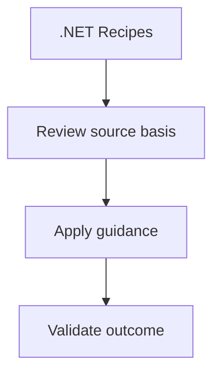

# .NET Recipes

A collection of focused code snippets for specific Azure Communication Services scenarios.

| Recipe | Description |
| --- | --- |
| [Managed Identity](./managed-identity.md) | Authenticate using `DefaultAzureCredential`. |
| [Key Vault Reference](./key-vault-reference.md) | Retrieve connection strings securely. |
| [Event Grid Webhooks](./event-grid-webhooks.md) | Handle ACS events with ASP.NET Core. |
| [Phone Number Management](./phone-number-management.md) | Search and purchase numbers programmatically. |
| [Teams Interop](./teams-interop.md) | Integrate with Microsoft Teams meetings. |

## Page Flow

<!-- diagram-id: index-page-flow -->

## See Also

- [Guide home](../../../index.md)
- [Start here](../../../start-here/overview.md)

## Sources

- [Microsoft Learn source 1](https://learn.microsoft.com/en-us/azure/communication-services/overview)
