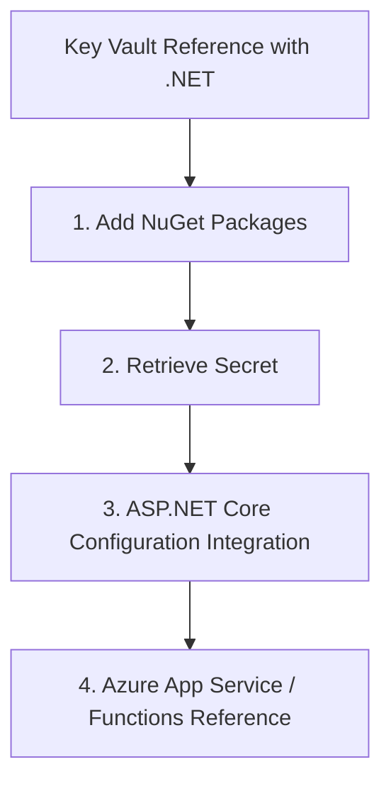

# Key Vault Reference with .NET

Store your ACS credentials securely in Azure Key Vault and retrieve them using the .NET SDK.

## 1. Add NuGet Packages

```bash
dotnet add package Azure.Security.KeyVault.Secrets
dotnet add package Azure.Identity
```

## 2. Retrieve Secret

```csharp
using Azure.Identity;
using Azure.Security.KeyVault.Secrets;

string keyVaultUrl = "https://<your-keyvault-name>.vault.azure.net/";
var secretClient = new SecretClient(new Uri(keyVaultUrl), new DefaultAzureCredential());

KeyVaultSecret secret = await secretClient.GetSecretAsync("ACS-Connection-String");
string connectionString = secret.Value;
```

## 3. ASP.NET Core Configuration Integration

You can add Key Vault as a configuration source in `Program.cs`.

```csharp
using Azure.Identity;

builder.Configuration.AddAzureKeyVault(
    new Uri(builder.Configuration["KeyVaultUrl"]),
    new DefaultAzureCredential());

// Now access it like any other config
string acsConnectionString = builder.Configuration["ACS-Connection-String"];
```

## 4. Azure App Service / Functions Reference

Use the `@Microsoft.KeyVault` syntax in your Application Settings to automatically inject secrets as environment variables.

- **Setting Name**: `ACS_CONNECTION_STRING`
- **Value**: `@Microsoft.KeyVault(SecretUri=https://myvault.vault.azure.net/secrets/ACS-Connection-String/)`

In C#, read it via `Environment.GetEnvironmentVariable("ACS_CONNECTION_STRING")`.

## Page Flow

<!-- diagram-id: key-vault-reference-page-flow -->


## Review Matrix

| Review area | Page-specific check |
|---|---|
| Scope | Confirm the guidance applies to Key Vault Reference with .NET. |
| Source basis | Validate the recommendation against the Microsoft Learn sources in this page. |
| Evidence | Capture command output, portal state, metrics, logs, or screenshots before treating the result as proven. |

## See Also

- [Guide home](../../../index.md)
- [Section index](index.md)
- [Start here](../../../start-here/overview.md)

## Sources
- [Azure Key Vault Secret client library for .NET](https://learn.microsoft.com/en-us/dotnet/api/overview/azure/security.keyvault.secrets-readme?view=azure-dotnet)
