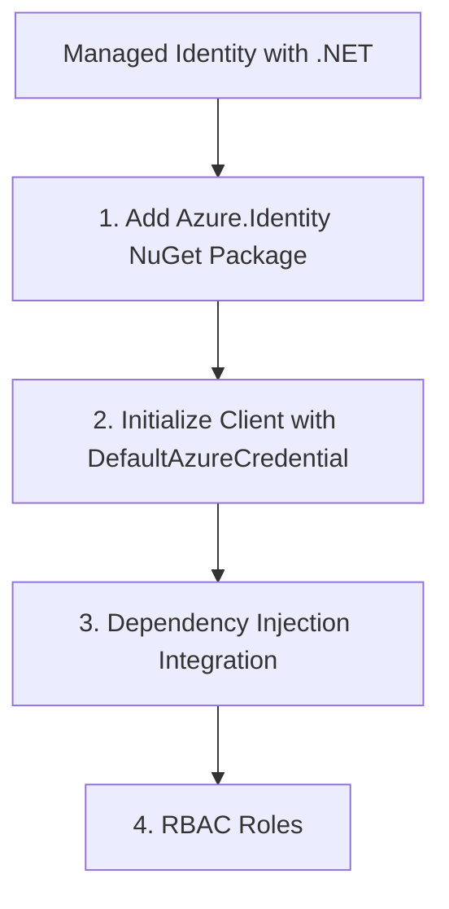

# Managed Identity with .NET

Managed Identity provides a secure way to authenticate your .NET application without managing connection strings.

## 1. Add Azure.Identity NuGet Package

```bash
dotnet add package Azure.Identity
```

## 2. Initialize Client with DefaultAzureCredential

Instead of a connection string, provide the resource endpoint and a `DefaultAzureCredential` instance.

```csharp
using Azure.Identity;
using Azure.Communication.Sms;

string endpoint = "https://<your-resource-name>.communication.azure.com";

var smsClient = new SmsClient(
    new Uri(endpoint), 
    new DefaultAzureCredential());

// Use the client as usual
await smsClient.SendAsync(...);
```

## 3. Dependency Injection Integration

In an ASP.NET Core application, register the client in `Program.cs`.

```csharp
using Microsoft.Extensions.Azure;

builder.Services.AddAzureClients(clientBuilder =>
{
    clientBuilder.AddSmsClient(new Uri(builder.Configuration["AcsEndpoint"]));
    clientBuilder.UseCredential(new DefaultAzureCredential());
});
```

## 4. RBAC Roles

Ensure your application's identity has the correct roles assigned:

- **Communication User**: Access to identity and messaging.
- **Communication Service Contributor**: Full management access.

## Page Flow

<!-- diagram-id: managed-identity-page-flow -->


## Review Matrix

| Review area | Page-specific check |
|---|---|
| Scope | Confirm the guidance applies to Managed Identity with .NET. |
| Source basis | Validate the recommendation against the Microsoft Learn sources in this page. |
| Evidence | Capture command output, portal state, metrics, logs, or screenshots before treating the result as proven. |

## See Also

- [Guide home](../../../index.md)
- [Section index](index.md)
- [Start here](../../../start-here/overview.md)

## Sources
- [Authenticate with Microsoft Entra ID](https://learn.microsoft.com/azure/communication-services/concepts/authentication)
- [Azure Identity client library for .NET](https://learn.microsoft.com/dotnet/api/overview/azure/identity-readme)
