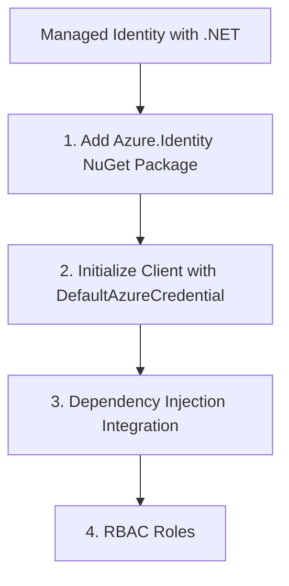

---
content_sources:
  diagrams:
    - id: dotnet-recipe-managed-identity-flow
      type: flowchart
      source: self-generated
      justification: Sequential walkthrough of this page's own step structure.

title: Managed Identity with .NET
description: Use DefaultAzureCredential to authenticate the Azure Communication Services .NET SDK.
---

# Managed Identity with .NET

Managed Identity provides a secure way to authenticate your .NET application without managing connection strings.

This recipe walks these steps in order:

<!-- diagram-id: dotnet-recipe-managed-identity-flow -->

```mermaid
flowchart TD
    START["Managed Identity with .NET"]
    N1["1. Add Azure.Identity NuGet Package"]
    N2["2. Initialize Client with DefaultAzureCredential"]
    N3["3. Dependency Injection Integration"]
    N4["4. RBAC Roles"]
    START --> N1
    N1 --> N2
    N2 --> N3
    N3 --> N4
```

## 1. Add Azure.Identity NuGet Package

```bash
dotnet add package Azure.Identity
```

## 2. Initialize Client with DefaultAzureCredential

Instead of a connection string, provide the resource endpoint and a `DefaultAzureCredential` instance.

```csharp
using Azure.Identity;
using Azure.Communication.Sms;

string endpoint = "https://<your-resource-name>.communication.azure.com";

var smsClient = new SmsClient(
    new Uri(endpoint), 
    new DefaultAzureCredential());

// Use the client as usual
await smsClient.SendAsync(...);
```

## 3. Dependency Injection Integration

In an ASP.NET Core application, register the client in `Program.cs`.

```csharp
using Microsoft.Extensions.Azure;

builder.Services.AddAzureClients(clientBuilder =>
{
    clientBuilder.AddSmsClient(new Uri(builder.Configuration["AcsEndpoint"]));
    clientBuilder.UseCredential(new DefaultAzureCredential());
});
```

## 4. RBAC Roles

Ensure your application's identity has the correct roles assigned:

- **Communication User**: Access to identity and messaging.
- **Communication Service Contributor**: Full management access.

## See Also
- [.NET Recipes](./index.md)
- [.NET SDK Guide](../index.md)

## Sources
- [Authenticate with Microsoft Entra ID](https://learn.microsoft.com/en-us/azure/communication-services/concepts/authentication)
- [Azure Identity client library for .NET](https://learn.microsoft.com/en-us/dotnet/api/overview/azure/identity-readme)
