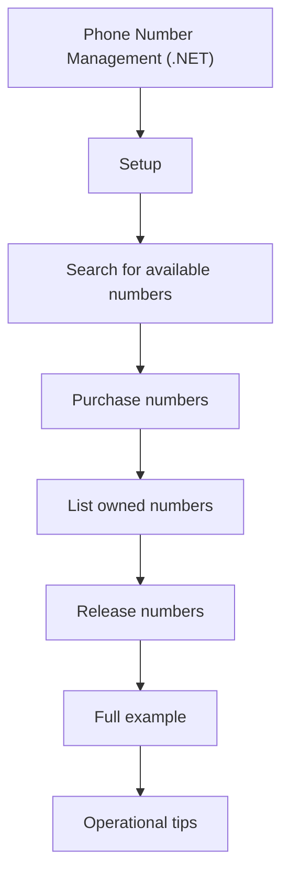

# Phone Number Management (.NET)

The Phone Numbers SDK is useful when you need to provision numbers for SMS, voice, or call automation.

This recipe walks these steps in order:

<!-- diagram-id: dotnet-recipe-phone-number-management-flow -->


## Setup

```csharp
using Azure.Communication.PhoneNumbers;

var client = new PhoneNumbersClient("endpoint=https://contoso.communication.azure.com/;accesskey=...");
```

| Operation | Typical inputs |
| --- | --- |
| Search | Country, number type, capabilities |
| Purchase | Search id, quantity |
| List owned | None |
| Release | Phone number in E.164 format |

## Search for available numbers

```csharp
var searchResponse = await client.StartSearchAvailablePhoneNumbersAsync(new PhoneNumberSearchOptions(
    countryCode: "US",
    phoneNumberType: PhoneNumberType.TollFree,
    assignmentType: PhoneNumberAssignmentType.Application,
    capabilities: new PhoneNumberCapabilities(voice: PhoneNumberCapabilityType.Outbound, sms: PhoneNumberCapabilityType.Inbound)));

var searchResult = await searchResponse.WaitForCompletionAsync();
Console.WriteLine($"Search id: {searchResult.Value.SearchId}");
```

## Purchase numbers

```csharp
await client.PurchasePhoneNumbersAsync(searchResult.Value.SearchId);
Console.WriteLine("Purchased numbers from the completed search.");
```

## List owned numbers

```csharp
await foreach (var number in client.GetPurchasedPhoneNumbersAsync())
{
    Console.WriteLine($"{number.PhoneNumber} | {number.CountryCode} | {number.PhoneNumberType}");
}
```

## Release numbers

```csharp
await client.ReleasePhoneNumberAsync("+18005550100");
Console.WriteLine("Number released.");
```

## Full example

```csharp
using Azure.Communication.PhoneNumbers;

var client = new PhoneNumbersClient(Environment.GetEnvironmentVariable("ACS_CONNECTION_STRING"));

var search = await client.StartSearchAvailablePhoneNumbersAsync(new PhoneNumberSearchOptions(
    countryCode: "US",
    phoneNumberType: PhoneNumberType.Geographic,
    assignmentType: PhoneNumberAssignmentType.Application,
    capabilities: new PhoneNumberCapabilities(
        voice: PhoneNumberCapabilityType.Outbound,
        sms: PhoneNumberCapabilityType.Inbound)));

var completed = await search.WaitForCompletionAsync();
Console.WriteLine($"Search completed: {completed.Value.SearchId}");

await client.PurchasePhoneNumbersAsync(completed.Value.SearchId);

await foreach (var phone in client.GetPurchasedPhoneNumbersAsync())
{
    Console.WriteLine(phone.PhoneNumber);
}
```

## Operational tips

!!! note "Release carefully"
    Releasing a number can be irreversible. Confirm that no live application depends on it.

## See Also

- [Managed Identity for .NET](./managed-identity.md)
- [Key Vault Reference for .NET](./key-vault-reference.md)

## Sources

- https://learn.microsoft.com/en-us/azure/communication-services/quickstarts/telephony/phone-number-management
- https://learn.microsoft.com/en-us/azure/communication-services/concepts/telephony/phone-numbers
