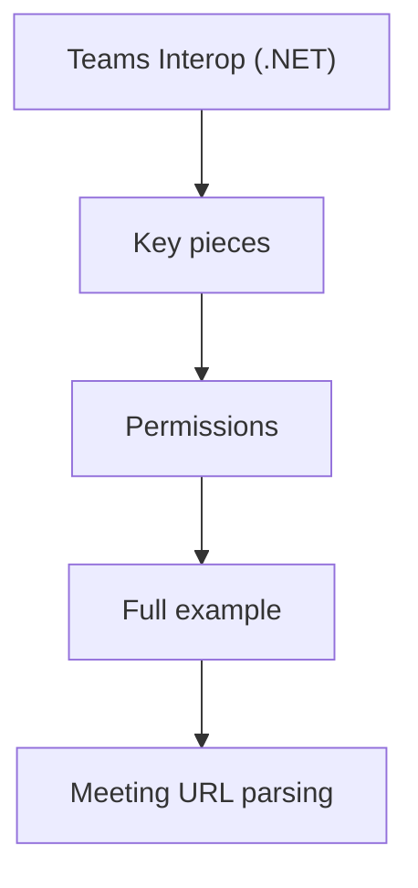

# Teams Interop (.NET)

Teams interop lets your ACS application join a Microsoft Teams meeting as a participant.

## Key pieces

| Component | Purpose |
| --- | --- |
| `CommunicationIdentityClient` | Creates identities and access tokens |
| `CallAutomationClient` | Joins the Teams meeting |
| Meeting URL parsing | Extracts the join target |

## Permissions

!!! warning "Consent matters"
    Your ACS resource must be allowed to join the target Teams meeting. Follow tenant and meeting policy requirements before production use.

## Full example

```csharp
using Azure;
using Azure.Communication;
using Azure.Communication.Identity;
using Azure.Communication.CallAutomation;

var connectionString = Environment.GetEnvironmentVariable("ACS_CONNECTION_STRING");
var callbackUri = new Uri(Environment.GetEnvironmentVariable("CALLBACK_URI")!);
var teamsMeetingUrl = Environment.GetEnvironmentVariable("TEAMS_MEETING_URL")!;

var identityClient = new CommunicationIdentityClient(connectionString);
var identityResponse = await identityClient.CreateUserAndTokenAsync(new[] { CommunicationTokenScope.VoIP });
Console.WriteLine($"Bot user id: {identityResponse.Value.User.Id}");

var callAutomationClient = new CallAutomationClient(connectionString);

// Teams meeting URLs are passed directly to the meeting locator.
var joinOptions = new JoinCallOptions(new TeamsMeetingLinkLocator(teamsMeetingUrl), callbackUri)
{
    OperationContext = "teams-interop-demo"
};

Response<JoinCallResult> result = await callAutomationClient.JoinCallAsync(joinOptions);
Console.WriteLine($"Call connection id: {result.Value.CallConnectionProperties.CallConnectionId}");
```

## Meeting URL parsing

If you accept user input, validate the meeting URL before joining:

```csharp
if (!Uri.TryCreate(teamsMeetingUrl, UriKind.Absolute, out var uri) || uri.Host is null)
{
    throw new InvalidOperationException("Invalid Teams meeting URL.");
}
```

## Operational notes

- Use a backend service to hold the ACS connection string
- Store callback URLs behind TLS
- Correlate meeting joins with application logs
- Handle retries when the meeting is not yet available

## Page Flow

<!-- diagram-id: teams-interop-page-flow -->


## See Also

- [Call Automation concepts](../index.md)
- [Identity token quickstart](./managed-identity.md)

## Sources

- https://learn.microsoft.com/en-us/azure/communication-services/concepts/call-automation/call-automation-teams-interop
- https://learn.microsoft.com/azure/communication-services/quickstarts/identity/access-tokens
