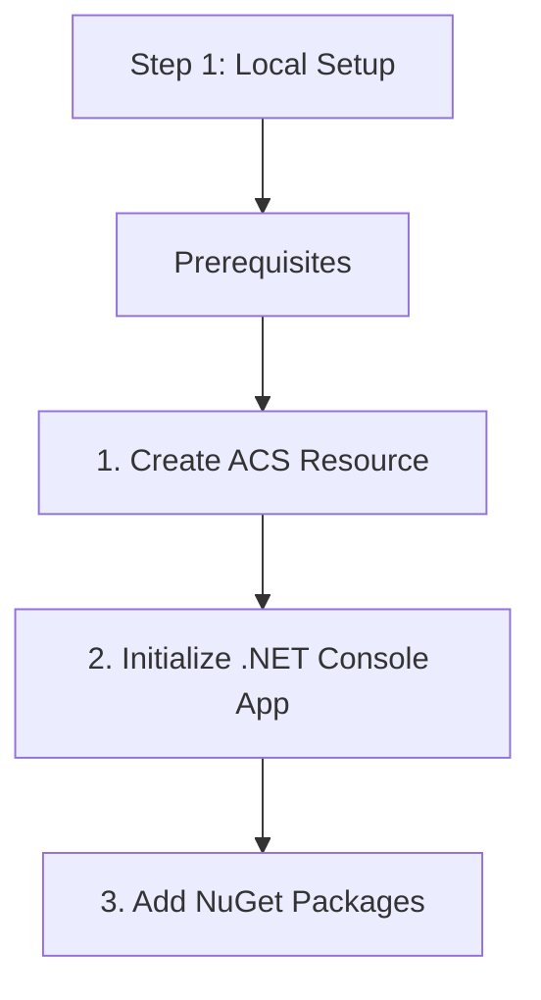

# Step 1: Local Setup

Prepare your development environment and Azure resources for .NET development.

## Prerequisites

1.  **.NET 6+ SDK**: Ensure the latest SDK is installed.
2.  **Azure CLI**: For resource management.
3.  **Visual Studio or VS Code**: Recommended IDEs.

## 1. Create ACS Resource

Use the Azure CLI to create a resource:

```bash
az communication create --name "MyACSResource" --location "Global" --data-location "United States" --resource-group "MyResourceGroup"
```

Copy the **Connection String** from the output or the Azure Portal.

## 2. Initialize .NET Console App

Create a new console application:

```bash
dotnet new console -n CommunicationApp
cd CommunicationApp
```

## 3. Add NuGet Packages

Add the Identity SDK to get started:

```bash
dotnet add package Azure.Communication.Identity
```

## 4. Set Up User Secrets

For local development, use **User Secrets** to store your connection string securely.

```bash
dotnet user-secrets init
dotnet user-secrets set "CommunicationServices:ConnectionString" "<your-connection-string>"
```

## 5. Verify Setup

Update `Program.cs` to verify connectivity:

```csharp
using Azure.Communication.Identity;
using Microsoft.Extensions.Configuration;

var config = new ConfigurationBuilder().AddUserSecrets<Program>().Build();
string connectionString = config["CommunicationServices:ConnectionString"];

if (string.IsNullOrEmpty(connectionString))
{
    Console.WriteLine("Connection string not found in user secrets.");
    return;
}

var client = new CommunicationIdentityClient(connectionString);
var user = await client.CreateUserAsync();

Console.WriteLine($"Successfully created user with ID: {user.Value.Id}");
```

Run the application:
```bash
dotnet run
```

## Next Step

Now that your environment is ready, let's [Send an SMS](./02-send-sms.md).

## Page Flow

<!-- diagram-id: 01-local-setup-page-flow -->


## Review Matrix

| Review area | Page-specific check |
|---|---|
| Scope | Confirm the guidance applies to Step 1: Local Setup. |
| Source basis | Validate the recommendation against the Microsoft Learn sources in this page. |
| Evidence | Capture command output, portal state, metrics, logs, or screenshots before treating the result as proven. |

## See Also

- [Guide home](../../../index.md)
- [Section index](index.md)
- [Start here](../../../start-here/overview.md)

## Sources
- [Quickstart: Create and manage Communication Services resources](https://learn.microsoft.com/azure/communication-services/quickstarts/create-communication-resource)
