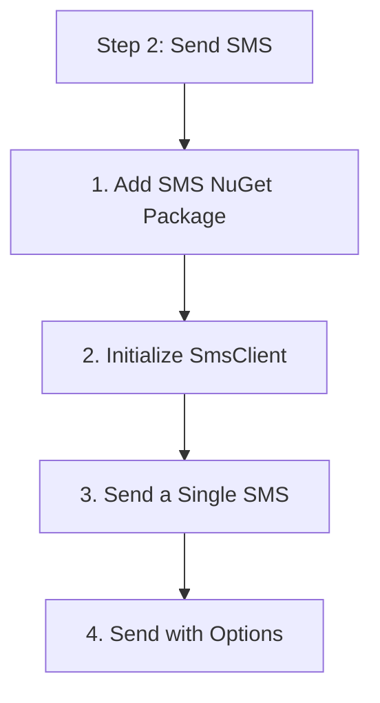

# Step 2: Send SMS

In this step, you will use the `SmsClient` to send text messages.

## 1. Add SMS NuGet Package

```bash
dotnet add package Azure.Communication.Sms
```

## 2. Initialize SmsClient

You can initialize the client using your connection string.

```csharp
using Azure.Communication.Sms;

string connectionString = Environment.GetEnvironmentVariable("COMMUNICATION_SERVICES_CONNECTION_STRING");
SmsClient smsClient = new SmsClient(connectionString);
```

## 3. Send a Single SMS

```csharp
public async Task SendSingleSms()
{
    SmsSendResult result = await smsClient.SendAsync(
        from: "<your-acs-number>",
        to: "<recipient-number>",
        message: "Hello from the .NET SDK Tutorial!"
    );

    Console.WriteLine($"Message ID: {result.MessageId}");
}
```

## 4. Send with Options

You can enable delivery reports by passing `SmsSendOptions`.

```csharp
public async Task SendSmsWithOptions()
{
    var options = new SmsSendOptions(enableDeliveryReport: true)
    {
        Tag = "marketing-campaign"
    };

    SmsSendResult result = await smsClient.SendAsync(
        from: "<your-acs-number>",
        to: "<recipient-number>",
        message: "Check out our new summer deals!",
        options: options
    );
    
    Console.WriteLine("Sent with delivery reporting enabled.");
}
```

## 5. Error Handling

Handle `RequestFailedException` to catch SDK-specific errors.

```csharp
using Azure;

try
{
    await smsClient.SendAsync(from, to, message);
}
catch (RequestFailedException ex)
{
    Console.WriteLine($"Failed to send SMS. Error: {ex.Message}");
    Console.WriteLine($"Status: {ex.Status}");
}
```

## Full Code Example

```csharp
using System;
using System.Threading.Tasks;
using Azure.Communication.Sms;

class Program
{
    static async Task Main(string[] args)
    {
        string connectionString = Environment.GetEnvironmentVariable("COMMUNICATION_SERVICES_CONNECTION_STRING");
        SmsClient smsClient = new SmsClient(connectionString);

        var result = await smsClient.SendAsync(
            from: "+1234567890",
            to: "+10987654321",
            message: "Hello from .NET!"
        );

        Console.WriteLine($"Message sent: {result.Value.MessageId}");
    }
}
```

## Next Step

Learn how to [Send Email](./03-send-email.md).

## Page Flow

<!-- diagram-id: 02-send-sms-page-flow -->


## Review Matrix

| Review area | Page-specific check |
|---|---|
| Scope | Confirm the guidance applies to Step 2: Send SMS. |
| Source basis | Validate the recommendation against the Microsoft Learn sources in this page. |
| Evidence | Capture command output, portal state, metrics, logs, or screenshots before treating the result as proven. |

## See Also

- [Guide home](../../../index.md)
- [Section index](index.md)
- [Start here](../../../start-here/overview.md)

## Sources
- [Quickstart: Send an SMS message](https://learn.microsoft.com/azure/communication-services/quickstarts/sms/send)
