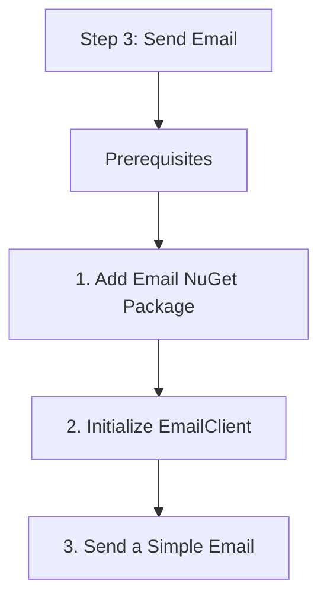

# Step 3: Send Email

This step covers sending transactional emails using the `EmailClient`.

## Prerequisites

- An Azure Communication Services resource.
- An Azure Email Communication Services resource linked to your ACS resource.
- A verified domain and a "From" email address.

## 1. Add Email NuGet Package

```bash
dotnet add package Azure.Communication.Email
```

## 2. Initialize EmailClient

```csharp
using Azure.Communication.Email;

string connectionString = Environment.GetEnvironmentVariable("COMMUNICATION_SERVICES_CONNECTION_STRING");
EmailClient emailClient = new EmailClient(connectionString);
```

## 3. Send a Simple Email

```csharp
public async Task SendEmail()
{
    var emailMessage = new EmailMessage(
        senderAddress: "do-not-reply@yourdomain.com",
        recipientAddress: "user@example.com",
        subject: "Welcome to ACS",
        htmlContent: "<html><h1>Hello!</h1><p>This is a test email from .NET.</p></html>"
    );

    EmailSendOperation emailSendOperation = await emailClient.SendAsync(
        WaitUntil.Completed,
        emailMessage);
    
    Console.WriteLine($"Email status: {emailSendOperation.Value.Status}");
}
```

## 4. Send with Attachments

```csharp
public async Task SendEmailWithAttachment()
{
    var content = await File.ReadAllBytesAsync("report.pdf");
    var attachment = new EmailAttachment(
        "report.pdf",
        "application/pdf",
        new BinaryData(content)
    );

    var emailMessage = new EmailMessage(
        senderAddress: "sender@yourdomain.com",
        recipientAddress: "user@example.com",
        subject: "Monthly Report",
        plainTextContent: "Please find the attached report.");
    
    emailMessage.Attachments.Add(attachment);

    await emailClient.SendAsync(WaitUntil.Completed, emailMessage);
}
```

## 5. Polling for Status

In .NET, you can use `WaitUntil.Completed` to block until the email is sent, or `WaitUntil.Started` to get an operation ID for later polling.

```csharp
EmailSendOperation operation = await emailClient.SendAsync(WaitUntil.Started, emailMessage);
string operationId = operation.Id;
Console.WriteLine($"Operation ID: {operationId}");
```

## Full Code Example

```csharp
using System;
using System.IO;
using System.Threading.Tasks;
using Azure;
using Azure.Communication.Email;

class Program
{
    static async Task Main(string[] args)
    {
        string connectionString = Environment.GetEnvironmentVariable("COMMUNICATION_SERVICES_CONNECTION_STRING");
        var emailClient = new EmailClient(connectionString);

        var emailMessage = new EmailMessage(
            senderAddress: "donotreply@yourdomain.com",
            recipientAddress: "user@example.com",
            subject: ".NET Email Quickstart",
            plainTextContent: "This is the body of the email.");

        var operation = await emailClient.SendAsync(WaitUntil.Completed, emailMessage);
        Console.WriteLine($"Email sent with ID: {operation.Id}");
    }
}
```

## Next Step

Build real-time features with [Chat](./04-chat.md).

## Page Flow

<!-- diagram-id: 03-send-email-page-flow -->


## Review Matrix

| Review area | Page-specific check |
|---|---|
| Scope | Confirm the guidance applies to Step 3: Send Email. |
| Source basis | Validate the recommendation against the Microsoft Learn sources in this page. |
| Evidence | Capture command output, portal state, metrics, logs, or screenshots before treating the result as proven. |

## See Also

- [Guide home](../../../index.md)
- [Section index](index.md)
- [Start here](../../../start-here/overview.md)

## Sources
- [Quickstart: How to send an email using Azure Communication Services](https://learn.microsoft.com/azure/communication-services/quickstarts/email/send-email)
