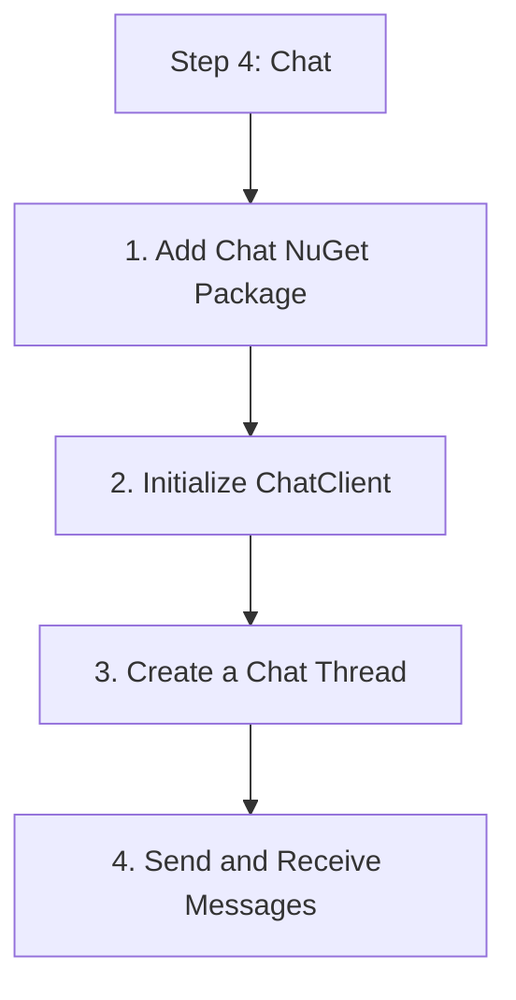

# Step 4: Chat

Learn how to create chat threads, add participants, and send messages using the `ChatClient`.

## 1. Add Chat NuGet Package

```bash
dotnet add package Azure.Communication.Chat
```

## 2. Initialize ChatClient

Chat operations require a User Access Token.

```csharp
using Azure.Communication.Chat;
using Azure.Communication;

string endpoint = "https://<your-resource>.communication.azure.com";
string userAccessToken = "<user-access-token>";

ChatClient chatClient = new ChatClient(new Uri(endpoint), new CommunicationTokenCredential(userAccessToken));
```

## 3. Create a Chat Thread

```csharp
public async Task CreateThread()
{
    var chatParticipant = new ChatParticipant(new CommunicationUserIdentifier("<second-user-id>"))
    {
        DisplayName = "Jane Doe"
    };

    CreateChatThreadOptions options = new CreateChatThreadOptions("General Support");
    options.Participants.Add(chatParticipant);

    CreateChatThreadResult result = await chatClient.CreateChatThreadAsync(options);
    string threadId = result.ChatThread.Id;
    Console.WriteLine($"Thread created with ID: {threadId}");
}
```

## 4. Send and Receive Messages

```csharp
public async Task SendMessage(string threadId)
{
    ChatThreadClient threadClient = chatClient.GetChatThreadClient(threadId);
    
    SendChatMessageResult result = await threadClient.SendMessageAsync("Hello everyone!");
    Console.WriteLine($"Message sent with ID: {result.Id}");
}

public async Task ListMessages(string threadId)
{
    ChatThreadClient threadClient = chatClient.GetChatThreadClient(threadId);
    
    AsyncPageable<ChatMessage> allMessages = threadClient.GetMessagesAsync();
    await foreach (ChatMessage message in allMessages)
    {
        Console.WriteLine($"{message.SenderDisplayName}: {message.Content.Message}");
    }
}
```

## 5. Real-time Notifications

While the SDK provides the messaging logic, real-time notifications (like typing indicators and message arrivals) are often handled by integrating with **Azure Web PubSub** or **SignalR**.

```csharp
// Example: Send typing indicator
await threadClient.SendTypingIndicatorAsync();
```

## Full Code Example

```csharp
using System;
using System.Threading.Tasks;
using Azure.Communication.Chat;
using Azure.Communication;

class Program
{
    static async Task Main(string[] args)
    {
        // Initialize client and perform chat operations
    }
}
```

## Next Step

Implement voice features with [Voice Calling](./05-voice-calling.md).

## Page Flow

<!-- diagram-id: 04-chat-page-flow -->


## Review Matrix

| Review area | Page-specific check |
|---|---|
| Scope | Confirm the guidance applies to Step 4: Chat. |
| Source basis | Validate the recommendation against the Microsoft Learn sources in this page. |
| Evidence | Capture command output, portal state, metrics, logs, or screenshots before treating the result as proven. |

## See Also

- [Guide home](../../../index.md)
- [Section index](index.md)
- [Start here](../../../start-here/overview.md)

## Sources
- [Quickstart: Join a chat thread](https://learn.microsoft.com/azure/communication-services/quickstarts/chat/get-started)
