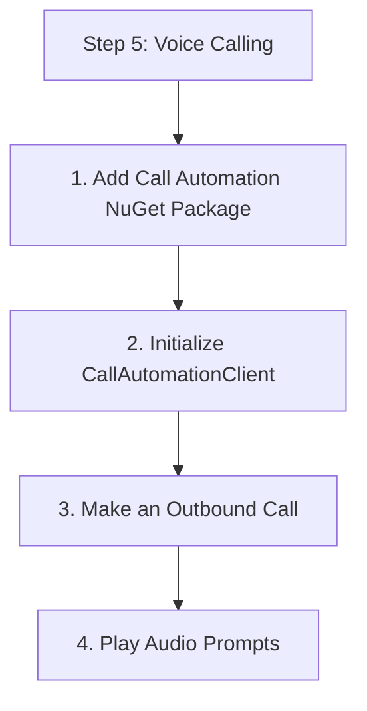

# Step 5: Voice Calling

Use the `CallAutomationClient` to make outbound calls and handle telephony events.

## 1. Add Call Automation NuGet Package

```bash
dotnet add package Azure.Communication.CallAutomation
```

## 2. Initialize CallAutomationClient

```csharp
using Azure.Communication.CallAutomation;

string connectionString = Environment.GetEnvironmentVariable("COMMUNICATION_SERVICES_CONNECTION_STRING");
CallAutomationClient callClient = new CallAutomationClient(connectionString);
```

## 3. Make an Outbound Call

```csharp
using Azure.Communication;

public async Task MakeCall()
{
    var target = new PhoneNumberIdentifier("+1234567890");
    var caller = new PhoneNumberIdentifier("+10987654321");
    var callbackUri = new Uri("https://your-app.com/callbacks/call");

    CallInvite invite = new CallInvite(target, caller);
    CreateCallResult result = await callClient.CreateCallAsync(invite, callbackUri);
    
    Console.WriteLine($"Call Connection ID: {result.CallConnectionProperties.CallConnectionId}");
}
```

## 4. Play Audio Prompts

```csharp
public async Task PlayAudio(string callConnectionId)
{
    CallConnection callConnection = callClient.GetCallConnection(callConnectionId);
    
    var audioSource = new FileSource(new Uri("https://storage.com/welcome.wav"));
    await callConnection.GetCallMedia().PlayToAllAsync(audioSource);
}
```

## 5. DTMF Recognition

```csharp
public async Task StartRecognition(string callConnectionId)
{
    CallConnection callConnection = callClient.GetCallConnection(callConnectionId);
    
    var recognizeOptions = new CallMediaRecognizeDtmfOptions(new PhoneNumberIdentifier("+1234567890"), maxDigits: 1)
    {
        InterDigitTimeout = TimeSpan.FromSeconds(5),
        InterruptPrompt = true
    };

    await callConnection.GetCallMedia().StartRecognizingAsync(recognizeOptions);
}
```

## Full Code Example

```csharp
using System;
using System.Threading.Tasks;
using Azure.Communication.CallAutomation;
using Azure.Communication;

class Program
{
    static async Task Main(string[] args)
    {
        // Implementation for outbound call and event handling
    }
}
```

## Next Step

Implement [Logging & Monitoring](./06-logging-monitoring.md) for your application.

## Page Flow

<!-- diagram-id: 05-voice-calling-page-flow -->


## Review Matrix

| Review area | Page-specific check |
|---|---|
| Scope | Confirm the guidance applies to Step 5: Voice Calling. |
| Source basis | Validate the recommendation against the Microsoft Learn sources in this page. |
| Evidence | Capture command output, portal state, metrics, logs, or screenshots before treating the result as proven. |

## See Also

- [Guide home](../../../index.md)
- [Section index](index.md)
- [Start here](../../../start-here/overview.md)

## Sources
- [Quickstart: Make an outbound call using Call Automation](https://learn.microsoft.com/azure/communication-services/quickstarts/call-automation/quickstart-make-an-outbound-call)
