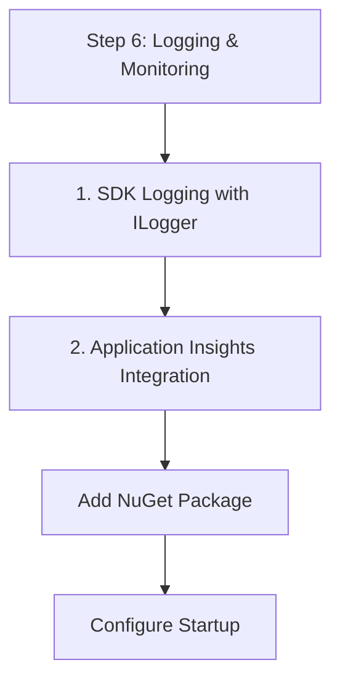

# Step 6: Logging & Monitoring

Track the health and performance of your .NET communication features using standard .NET logging patterns and Azure Monitor.

## 1. SDK Logging with ILogger

The Azure SDK for .NET integrates with `ILogger`. You can capture SDK logs by configuring your logging provider (e.g., Console, Serilog).

```csharp
using Azure.Core.Diagnostics;

// Listen to all SDK events and write them to the console
using AzureEventSourceListener listener = AzureEventSourceListener.CreateConsoleLogger();
```

## 2. Application Insights Integration

For ASP.NET Core applications, add the Application Insights SDK.

### Add NuGet Package
```bash
dotnet add package Microsoft.ApplicationInsights.AspNetCore
```

### Configure Startup
```csharp
public void ConfigureServices(IServiceCollection services)
{
    services.AddApplicationInsightsTelemetry(Configuration["APPLICATIONINSIGHTS_CONNECTION_STRING"]);
}
```

## 3. Client Diagnostics

You can configure diagnostic options when initializing your ACS clients.

```csharp
var options = new SmsClientOptions();
options.Diagnostics.IsLoggingEnabled = true;
options.Diagnostics.LoggedHeaderNames.Add("x-ms-request-id");

var client = new SmsClient(connectionString, options);
```

## 4. Custom Telemetry

Use `TelemetryClient` to track custom events related to communications.

```csharp
using Microsoft.ApplicationInsights;

public class MyService
{
    private readonly TelemetryClient _telemetryClient;

    public MyService(TelemetryClient telemetryClient)
    {
        _telemetryClient = telemetryClient;
    }

    public void TrackSmsSent()
    {
        _telemetryClient.TrackEvent("SMSSent");
    }
}
```

## 5. Diagnostic Settings in Azure

Ensure your ACS resource is configured to send logs to Log Analytics:

1.  Navigate to your ACS resource in the Azure Portal.
2.  Select **Diagnostic settings** > **Add diagnostic setting**.
3.  Select categories like **SMS Operational Logs** or **Email Operational Logs**.
4.  Send to your **Log Analytics workspace**.

## Next Step

Finalize your solution with [Infrastructure as Code](./07-infrastructure-as-code.md).

## Page Flow

<!-- diagram-id: 06-logging-monitoring-page-flow -->


## Review Matrix

| Review area | Page-specific check |
|---|---|
| Scope | Confirm the guidance applies to Step 6: Logging & Monitoring. |
| Source basis | Validate the recommendation against the Microsoft Learn sources in this page. |
| Evidence | Capture command output, portal state, metrics, logs, or screenshots before treating the result as proven. |

## See Also

- [Guide home](../../../index.md)
- [Section index](index.md)
- [Start here](../../../start-here/overview.md)

## Sources
- [Azure Communication Services Logs](https://learn.microsoft.com/azure/communication-services/concepts/logging-and-diagnostics)
- [Logging with the Azure SDK for .NET](https://learn.microsoft.com/dotnet/azure/sdk/logging)
