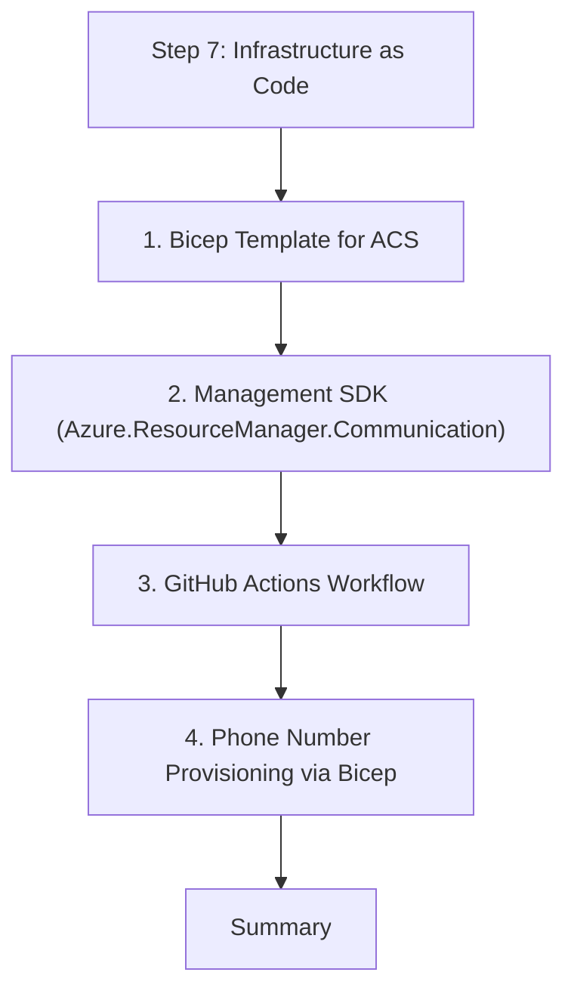

# Step 7: Infrastructure as Code

Automating your communication infrastructure ensures reliable deployments. This step covers Bicep templates and CI/CD for .NET.

This tutorial walks these steps in order:

<!-- diagram-id: dotnet-tutorial-infrastructure-as-code-flow -->


## 1. Bicep Template for ACS

Define your Communication Services resource in `main.bicep`.

```bicep
param resourceName string = 'acs-dotnet-prod'
param location string = 'global'

resource acs 'Microsoft.Communication/CommunicationServices@2023-03-31' = {
  name: resourceName
  location: location
  properties: {
    dataLocation: 'United States'
  }
}
```

## 2. Management SDK (Azure.ResourceManager.Communication)

In .NET, you can also manage infrastructure programmatically using the Management SDK.

```bash
dotnet add package Azure.ResourceManager.Communication
```

```csharp
using Azure.ResourceManager.Communication;

// Example: List all ACS resources in a resource group
var rg = client.GetResourceGroupResource(resourceGroupResourceId);
await foreach (var acsResource in rg.GetCommunicationServiceResources())
{
    Console.WriteLine(acsResource.Data.Name);
}
```

## 3. GitHub Actions Workflow

Create `.github/workflows/dotnet.yml` to build and test your app.

```yaml
name: .NET CI

on:
  push:
    branches: [ main ]

jobs:
  build:
    runs-on: ubuntu-latest
    steps:
    - uses: actions/checkout@v3
    
    - name: Setup .NET
      uses: actions/setup-dotnet@v3
      with:
        dotnet-version: 6.0.x
        
    - name: Restore dependencies
      run: dotnet restore
      
    - name: Build
      run: dotnet build --no-restore
      
    - name: Test
      run: dotnet test --no-build --verbosity normal
```

## 4. Phone Number Provisioning via Bicep

While phone numbers are often purchased manually, you can use Bicep to manage **Email Domains** and **Sender Usernames**.

```bicep
resource emailService 'Microsoft.Communication/EmailServices@2023-03-31' = {
  name: 'myEmailService'
  location: 'global'
  properties: {
    dataLocation: 'United States'
  }
}
```

## Summary

Congratulations! You have built a complete communication application with .NET, covering identity, messaging, real-time communication, and automated deployment.

## See Also
- [06. Logging & Monitoring](./06-logging-monitoring.md)
- [Tutorial Index](./index.md)
- [.NET Recipes](../recipes/index.md)

## Sources
- [Bicep documentation](https://learn.microsoft.com/en-us/azure/azure-resource-manager/bicep/)
- [Azure SDK for .NET Management Libraries](https://learn.microsoft.com/en-us/dotnet/azure/sdk/management)
