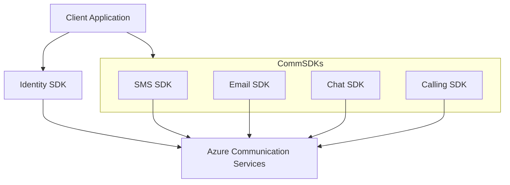

# SDK Guides Overview

Azure Communication Services (ACS) provides SDKs for multiple platforms, enabling developers to integrate communication features into their applications. This guide covers common scenarios and best practices for Python and JavaScript.

## Supported Features by SDK

The table below provides a high-level overview of feature support across the primary SDKs.

| Feature | Python | JavaScript | Java | .NET |
| --- | --- | --- | --- | --- |
| **Identity** | ✅ | ✅ | ✅ | ✅ |
| **SMS** | ✅ | ✅ | ✅ | ✅ |
| **Email** | ✅ | ✅ | ✅ | ✅ |
| **Chat** | ✅ | ✅ | ✅ | ✅ |
| **Calling (Client)** | ❌ | ✅ | ✅ | ✅ |
| **Calling (Automation)** | ✅ | ✅ | ✅ | ✅ |
| **Phone Numbers** | ✅ | ✅ | ✅ | ✅ |
| **Teams Interop** | ✅ | ✅ | ✅ | ✅ |

## SDK Architecture

ACS SDKs follow a consistent architectural pattern across languages, separating management (Identity, Numbers) from communication (Chat, SMS, Email, Calling).

<!-- diagram-id: sdk-architecture -->

## Available Guides

Choose your preferred language to get started with tutorials and code recipes.

- **[Python SDK Guide](./python/index.md)**: Server-side automation and integrations.
- **[JavaScript SDK Guide](./javascript/index.md)**: Web-based client applications and server-side logic.

## See Also
- [Azure Communication Services SDK Overview](https://learn.microsoft.com/azure/communication-services/concepts/sdk-options)
- [SDK Release Notes](https://learn.microsoft.com/azure/communication-services/concepts/release-notes)

## Sources
- [Azure Communication Services Documentation](https://learn.microsoft.com/azure/communication-services/)
