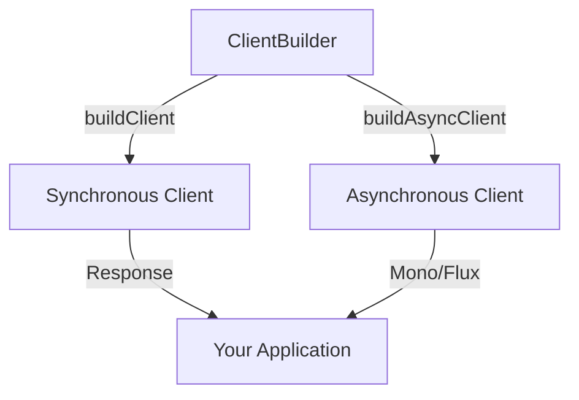

# Java SDK Guide

The Azure Communication Services (ACS) Java SDK allows developers to integrate SMS, email, chat, and voice calling into their applications. It follows standard Azure SDK for Java patterns, offering both synchronous and asynchronous clients.

## Maven Packages

The Java SDK is modular. You only need to include the specific dependencies for the features you use.

| Feature | Maven Artifact |
| --- | --- |
| **Identity** | `com.azure:azure-communication-identity` |
| **SMS** | `com.azure:azure-communication-sms` |
| **Email** | `com.azure:azure-communication-email` |
| **Chat** | `com.azure:azure-communication-chat` |
| **Phone Numbers** | `com.azure:azure-communication-phonenumbers` |
| **Call Automation** | `com.azure:azure-communication-callautomation` |

## Prerequisites

- Java Development Kit (JDK) 8 or later.
- Apache Maven for dependency management.
- An active Azure subscription and an ACS resource.

## Quick Start: Create an Identity Token

```java
import com.azure.communication.identity.CommunicationIdentityClient;
import com.azure.communication.identity.CommunicationIdentityClientBuilder;
import com.azure.communication.identity.models.CommunicationUserIdentifier;
import com.azure.communication.identity.models.CommunicationTokenScope;
import com.azure.core.credential.AccessToken;
import java.util.Arrays;

public class App {
    public static void main(String[] args) {
        String connectionString = System.getenv("COMMUNICATION_SERVICES_CONNECTION_STRING");
        
        CommunicationIdentityClient client = new CommunicationIdentityClientBuilder()
            .connectionString(connectionString)
            .buildClient();

        CommunicationUserIdentifier user = client.createUser();
        AccessToken token = client.getToken(user, Arrays.asList(CommunicationTokenScope.CHAT));
        
        System.out.println("User ID: " + user.getId());
        System.out.println("Token: " + token.getToken());
    }
}
```

## SDK Architecture

The Java SDK uses a builder pattern for client instantiation and provides a consistent experience across different service clients.

<!-- diagram-id: java-sdk-architecture -->


## Next Steps

- **[Tutorial](./tutorial/index.md)**: A complete guide to building a communication-enabled application.
- **[Recipes](./recipes/index.md)**: Snippets for specific common tasks and configurations.

## Sources
- [Azure Communication Services Java SDK Reference](https://learn.microsoft.com/java/api/overview/azure/communication-services)
- [Maven Central Repository](https://search.maven.org/)
