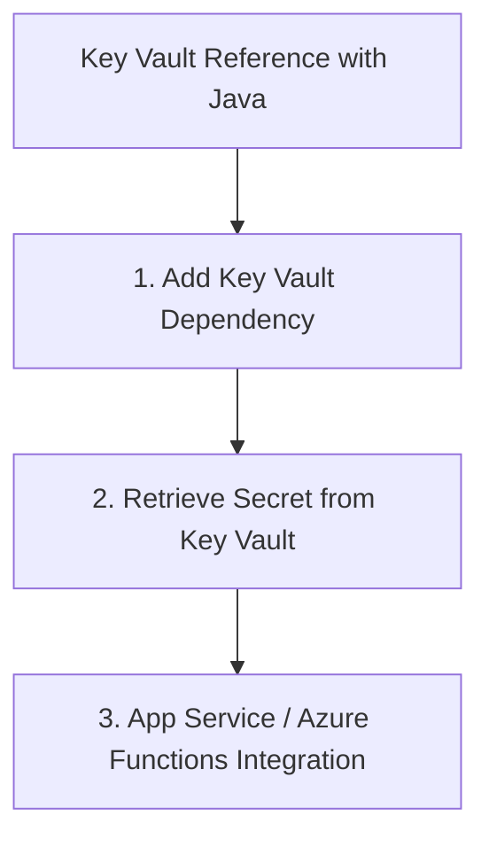

# Key Vault Reference with Java

Storing secrets in Azure Key Vault is a best practice for securing your communication resource credentials.

## 1. Add Key Vault Dependency

Add the following to your `pom.xml`:

```xml
<dependency>
    <groupId>com.azure</groupId>
    <artifactId>azure-security-keyvault-secrets</artifactId>
    <version>4.7.0</version>
</dependency>
<dependency>
    <groupId>com.azure</groupId>
    <artifactId>azure-identity</artifactId>
    <version>1.10.0</version>
</dependency>
```

## 2. Retrieve Secret from Key Vault

Use the `SecretClient` to fetch your ACS connection string at runtime.

```java
import com.azure.identity.DefaultAzureCredentialBuilder;
import com.azure.security.keyvault.secrets.SecretClient;
import com.azure.security.keyvault.secrets.SecretClientBuilder;
import com.azure.security.keyvault.secrets.models.KeyVaultSecret;

public class KeyVaultApp {
    public static void main(String[] args) {
        String keyVaultUrl = "https://<your-keyvault-name>.vault.azure.net/";
        
        SecretClient secretClient = new SecretClientBuilder()
            .vaultUrl(keyVaultUrl)
            .credential(new DefaultAzureCredentialBuilder().build())
            .buildClient();

        KeyVaultSecret secret = secretClient.getSecret("ACS-Connection-String");
        String connectionString = secret.getValue();
        
        System.out.println("Retrieved secret from Key Vault.");
        // Initialize your ACS clients using the connectionString
    }
}
```

## 3. App Service / Azure Functions Integration

If you are using Azure App Service or Azure Functions, you can use **Key Vault References** in your application settings without writing extra code to fetch secrets.

Set the app setting value to:
`@Microsoft.KeyVault(SecretUri=https://<your-vault>.vault.azure.net/secrets/<secret-name>/)`

Your Java app can then read it like a normal environment variable:
`System.getenv("ACS_CONNECTION_STRING")`

## Page Flow

<!-- diagram-id: key-vault-reference-page-flow -->


## Review Matrix

| Review area | Page-specific check |
|---|---|
| Scope | Confirm the guidance applies to Key Vault Reference with Java. |
| Source basis | Validate the recommendation against the Microsoft Learn sources in this page. |
| Evidence | Capture command output, portal state, metrics, logs, or screenshots before treating the result as proven. |

## See Also

- [Guide home](../../../index.md)
- [Section index](index.md)
- [Start here](../../../start-here/overview.md)

## Sources
- [Azure Key Vault Secret client library for Java](https://learn.microsoft.com/java/api/overview/azure/security-keyvault-secrets-readme)
