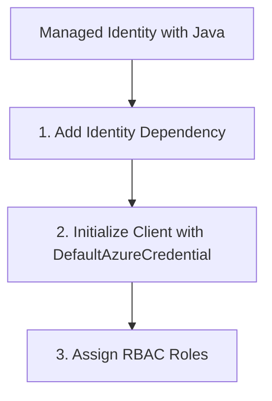

# Managed Identity with Java

Using Managed Identity avoids the need to manage connection strings in your application code or configuration.

## 1. Add Identity Dependency

Include `azure-identity` in your `pom.xml`.

```xml
<dependency>
    <groupId>com.azure</groupId>
    <artifactId>azure-identity</artifactId>
    <version>1.10.0</version>
</dependency>
```

## 2. Initialize Client with DefaultAzureCredential

`DefaultAzureCredential` automatically chooses the best authentication method (Managed Identity, Environment Variables, Azure CLI, etc.).

```java
import com.azure.communication.sms.SmsClient;
import com.azure.communication.sms.SmsClientBuilder;
import com.azure.identity.DefaultAzureCredentialBuilder;

public class ManagedIdentityApp {
    public static void main(String[] args) {
        String endpoint = "https://<your-resource-name>.communication.azure.com";

        SmsClient smsClient = new SmsClientBuilder()
            .endpoint(endpoint)
            .credential(new DefaultAzureCredentialBuilder().build())
            .buildClient();

        // Use the client as usual
    }
}
```

## 3. Assign RBAC Roles

For Managed Identity to work, you must assign the appropriate role to your application's identity in the Azure Portal:

- **Communication User**: General access.
- **Communication Service Contributor**: Management access.

Navigate to your ACS resource > **IAM (Access Control)** > **Add role assignment**.

## Page Flow

<!-- diagram-id: managed-identity-page-flow -->


## Review Matrix

| Review area | Page-specific check |
|---|---|
| Scope | Confirm the guidance applies to Managed Identity with Java. |
| Source basis | Validate the recommendation against the Microsoft Learn sources in this page. |
| Evidence | Capture command output, portal state, metrics, logs, or screenshots before treating the result as proven. |

## See Also

- [Guide home](../../../index.md)
- [Section index](index.md)
- [Start here](../../../start-here/overview.md)

## Sources
- [Authenticate with Microsoft Entra ID](https://learn.microsoft.com/azure/communication-services/concepts/authentication)
