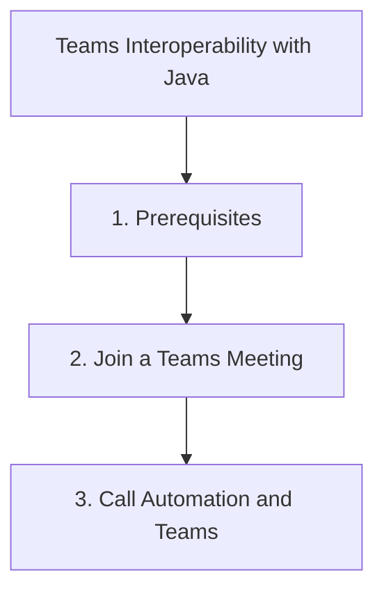

# Teams Interoperability with Java

Azure Communication Services allows your custom application users to join Microsoft Teams meetings.

## 1. Prerequisites

- A Microsoft 365 tenant.
- A Teams meeting URL.
- ACS Identity and Calling SDKs.

## 2. Join a Teams Meeting

To join a Teams meeting, you use the ACS Calling SDK (which is primarily a client-side SDK for Android/iOS/Web). However, you can manage the identity and token generation on the server-side with Java.

```java
import com.azure.communication.identity.CommunicationIdentityClient;
import com.azure.communication.identity.models.CommunicationTokenScope;
import com.azure.core.credential.AccessToken;
import java.util.Arrays;

public class TeamsInteropApp {
    public void getMeetingToken() {
        // 1. Generate an identity and token with 'voip' scope
        CommunicationIdentityClient client = new CommunicationIdentityClientBuilder()
            .connectionString("<connection-string>")
            .buildClient();

        CommunicationUserIdentifier user = client.createUser();
        AccessToken token = client.getToken(user, Arrays.asList(CommunicationTokenScope.VOIP));

        // 2. Pass this token and the Teams Meeting URL to your frontend (Web/Android/iOS)
        // Your frontend will use the ACS Calling Client to join via:
        // callAgent.join({ meetingLink: teamsMeetingLink });
    }
}
```

## 3. Call Automation and Teams

You can also use the **Call Automation SDK** to redirect or transfer calls to Teams users.

```java
import com.azure.communication.callautomation.models.MicrosoftTeamsUserIdentifier;

public void transferToTeamsUser(String callConnectionId, String teamsUserId) {
    CallConnection callConnection = callAutomationClient.getCallConnection(callConnectionId);
    
    MicrosoftTeamsUserIdentifier target = new MicrosoftTeamsUserIdentifier(teamsUserId);
    callConnection.transferCall(target);
}
```

## Page Flow

<!-- diagram-id: teams-interop-page-flow -->


## Review Matrix

| Review area | Page-specific check |
|---|---|
| Scope | Confirm the guidance applies to Teams Interoperability with Java. |
| Source basis | Validate the recommendation against the Microsoft Learn sources in this page. |
| Evidence | Capture command output, portal state, metrics, logs, or screenshots before treating the result as proven. |

## See Also

- [Guide home](../../../index.md)
- [Section index](index.md)
- [Start here](../../../start-here/overview.md)

## Sources
- [Teams Interoperability Guide](https://learn.microsoft.com/azure/communication-services/concepts/teams-interop)
