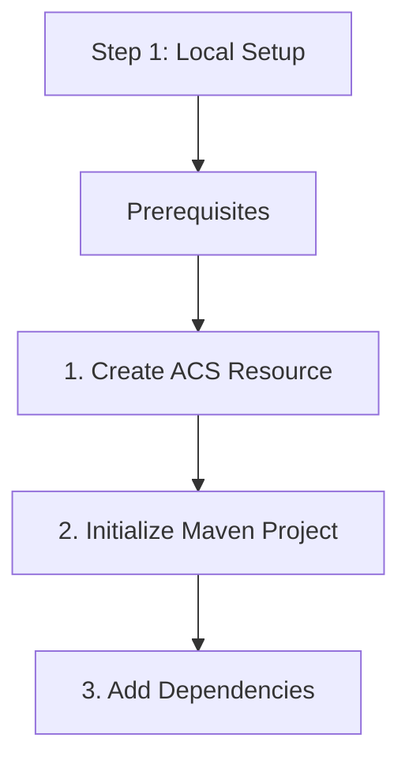

# Step 1: Local Setup

Before writing code, you need to prepare your development environment and Azure resources.

## Prerequisites

1.  **JDK 8+**: Ensure you have a Java Development Kit installed.
2.  **Maven**: Installed and added to your system path.
3.  **Azure CLI**: Useful for resource management (optional but recommended).

## 1. Create ACS Resource

Use the Azure Portal or CLI to create an Azure Communication Services resource:

```bash
az communication create --name "MyACSResource" --location "Global" --data-location "United States" --resource-group "MyResourceGroup"
```

Once created, navigate to the **Keys** section and copy the **Connection String**.

## 2. Initialize Maven Project

Create a new directory and initialize a Maven project:

```bash
mvn archetype:generate -DgroupId=com.communication.quickstart -DartifactId=communication-app -DarchetypeArtifactId=maven-archetype-quickstart -DinteractiveMode=false
```

## 3. Add Dependencies

Update your `pom.xml` to include the ACS Identity SDK:

```xml
<dependencies>
    <dependency>
        <groupId>com.azure</groupId>
        <artifactId>azure-communication-identity</artifactId>
        <version>1.5.0</version>
    </dependency>
    <!-- Core library for common types -->
    <dependency>
        <groupId>com.azure</groupId>
        <artifactId>azure-core</artifactId>
        <version>1.45.0</version>
    </dependency>
</dependencies>
```

## 4. Set Environment Variables

Avoid hardcoding connection strings. Set an environment variable:

```bash
export COMMUNICATION_SERVICES_CONNECTION_STRING="<your-connection-string>"
```

## 5. Verify Setup

Create a file named `App.java` and add the following code to verify you can connect to your resource:

```java
package com.communication.quickstart;

import com.azure.communication.identity.CommunicationIdentityClient;
import com.azure.communication.identity.CommunicationIdentityClientBuilder;
import com.azure.communication.identity.models.CommunicationUserIdentifier;

public class App {
    public static void main(String[] args) {
        String connectionString = System.getenv("COMMUNICATION_SERVICES_CONNECTION_STRING");
        
        if (connectionString == null || connectionString.isEmpty()) {
            System.err.println("Please set the COMMUNICATION_SERVICES_CONNECTION_STRING environment variable.");
            return;
        }

        CommunicationIdentityClient client = new CommunicationIdentityClientBuilder()
            .connectionString(connectionString)
            .buildClient();

        CommunicationUserIdentifier user = client.createUser();
        System.out.println("Successfully created user with ID: " + user.getId());
    }
}
```

Run the application:
```bash
mvn compile exec:java -Dexec.mainClass="com.communication.quickstart.App"
```

## Next Step

Now that your environment is ready, let's [Send an SMS](./02-send-sms.md).

## Page Flow

<!-- diagram-id: 01-local-setup-page-flow -->


## Review Matrix

| Review area | Page-specific check |
|---|---|
| Scope | Confirm the guidance applies to Step 1: Local Setup. |
| Source basis | Validate the recommendation against the Microsoft Learn sources in this page. |
| Evidence | Capture command output, portal state, metrics, logs, or screenshots before treating the result as proven. |

## See Also

- [Guide home](../../../index.md)
- [Section index](index.md)
- [Start here](../../../start-here/overview.md)

## Sources
- [Quickstart: Create and manage Communication Services resources](https://learn.microsoft.com/azure/communication-services/quickstarts/create-communication-resource)
