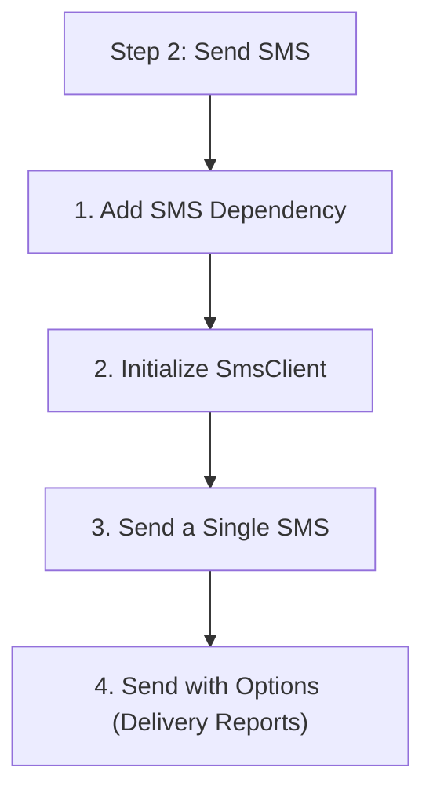

# Step 2: Send SMS

In this step, you will use the `SmsClient` to send text messages.

## 1. Add SMS Dependency

Add the following to your `pom.xml`:

```xml
<dependency>
    <groupId>com.azure</groupId>
    <artifactId>azure-communication-sms</artifactId>
    <version>1.1.0</version>
</dependency>
```

## 2. Initialize SmsClient

You can initialize the client using your connection string.

```java
import com.azure.communication.sms.SmsClient;
import com.azure.communication.sms.SmsClientBuilder;

String connectionString = System.getenv("COMMUNICATION_SERVICES_CONNECTION_STRING");
SmsClient smsClient = new SmsClientBuilder()
    .connectionString(connectionString)
    .buildClient();
```

## 3. Send a Single SMS

To send a message, you need a phone number acquired through ACS or a verified number (depending on region).

```java
import com.azure.communication.sms.models.SmsSendResult;
import java.util.ArrayList;
import java.util.List;

public void sendSingleSms() {
    SmsSendResult result = smsClient.send(
        "<from-phone-number>", // Your ACS phone number
        "<to-phone-number>",   // Recipient number in E.164 format
        "Hello from the Java SDK Tutorial!"
    );

    System.out.println("Message ID: " + result.getMessageId());
    System.out.println("Status: " + result.getHttpStatusCode());
}
```

## 4. Send with Options (Delivery Reports)

You can enable delivery reports by passing `SmsSendOptions`.

```java
import com.azure.communication.sms.models.SmsSendOptions;

public void sendSmsWithOptions() {
    SmsSendOptions options = new SmsSendOptions();
    options.setEnableDeliveryReport(true);
    options.setTag("marketing-campaign");

    SmsSendResult result = smsClient.send(
        "<from-phone-number>",
        "<to-phone-number>",
        "Check out our new summer deals!",
        options
    );
    
    System.out.println("Sent with delivery reporting enabled.");
}
```

## 5. Error Handling

Wrap your calls in try-catch blocks to handle `HttpResponseException`.

```java
import com.azure.core.exception.HttpResponseException;

try {
    smsClient.send(from, to, message);
} catch (HttpResponseException e) {
    System.err.println("Failed to send SMS. Status code: " + e.getResponse().getStatusCode());
    System.err.println("Error message: " + e.getMessage());
}
```

## Full Code Example

```java
package com.communication.quickstart;

import com.azure.communication.sms.SmsClient;
import com.azure.communication.sms.SmsClientBuilder;
import com.azure.communication.sms.models.SmsSendResult;

public class SmsApp {
    public static void main(String[] args) {
        String connectionString = System.getenv("COMMUNICATION_SERVICES_CONNECTION_STRING");
        SmsClient smsClient = new SmsClientBuilder()
            .connectionString(connectionString)
            .buildClient();

        SmsSendResult result = smsClient.send(
            "<your-acs-number>",
            "<recipient-number>",
            "Hello from Java!"
        );

        System.out.println("Message sent. ID: " + result.getMessageId());
    }
}
```

## Next Step

Learn how to [Send Email](./03-send-email.md).

## Page Flow

<!-- diagram-id: 02-send-sms-page-flow -->


## Review Matrix

| Review area | Page-specific check |
|---|---|
| Scope | Confirm the guidance applies to Step 2: Send SMS. |
| Source basis | Validate the recommendation against the Microsoft Learn sources in this page. |
| Evidence | Capture command output, portal state, metrics, logs, or screenshots before treating the result as proven. |

## See Also

- [Guide home](../../../index.md)
- [Section index](index.md)
- [Start here](../../../start-here/overview.md)

## Sources
- [Quickstart: Send an SMS message](https://learn.microsoft.com/azure/communication-services/quickstarts/sms/send)
