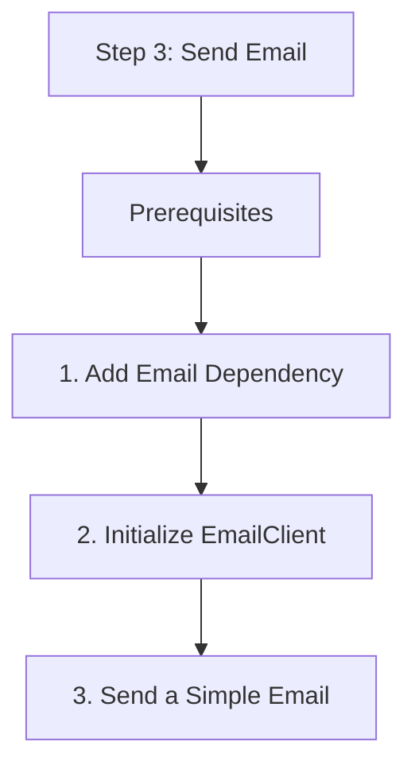

# Step 3: Send Email

This step covers sending transactional emails using the `EmailClient`.

## Prerequisites

- An Azure Communication Services resource.
- An Azure Email Communication Services resource linked to your ACS resource.
- A verified domain and a "From" email address.

## 1. Add Email Dependency

Add the following to your `pom.xml`:

```xml
<dependency>
    <groupId>com.azure</groupId>
    <artifactId>azure-communication-email</artifactId>
    <version>1.0.0</version>
</dependency>
```

## 2. Initialize EmailClient

```java
import com.azure.communication.email.EmailClient;
import com.azure.communication.email.EmailClientBuilder;

String connectionString = System.getenv("COMMUNICATION_SERVICES_CONNECTION_STRING");
EmailClient emailClient = new EmailClientBuilder()
    .connectionString(connectionString)
    .buildClient();
```

## 3. Send a Simple Email

Emails can be sent with plain text or HTML content.

```java
import com.azure.communication.email.models.*;
import com.azure.core.util.polling.SyncPoller;

public void sendEmail() {
    EmailMessage message = new EmailMessage()
        .setSenderAddress("do-not-reply@example.com")
        .setToRecipients("recipient@example.com")
        .setSubject("Welcome to ACS")
        .setBodyHtml("<html><h1>Hello!</h1><p>This is a test email from Java.</p></html>");

    SyncPoller<EmailSendResult, EmailSendResult> poller = emailClient.beginSend(message);
    EmailSendResult result = poller.getFinalResult();
    
    System.out.println("Email send status: " + result.getStatus());
}
```

## 4. Send with Attachments

You can attach files by providing the content as a `BinaryData` object.

```java
import com.azure.core.util.BinaryData;
import java.io.File;
import java.nio.file.Files;

public void sendEmailWithAttachment() throws Exception {
    byte[] fileContent = Files.readAllBytes(new File("report.pdf").toPath());
    EmailAttachment attachment = new EmailAttachment(
        "report.pdf",
        "application/pdf",
        BinaryData.fromBytes(fileContent)
    );

    EmailMessage message = new EmailMessage()
        .setSenderAddress("sender@example.com")
        .setToRecipients("recipient@example.com")
        .setSubject("Monthly Report")
        .setBodyPlainText("Please find the attached report.")
        .setAttachments(attachment);

    emailClient.beginSend(message);
}
```

## 5. Polling for Status

Since email delivery is asynchronous, the SDK returns a `SyncPoller` to track progress.

```java
SyncPoller<EmailSendResult, EmailSendResult> poller = emailClient.beginSend(message);
PollResponse<EmailSendResult> response = poller.waitForCompletion();
System.out.println("Operation ID: " + response.getValue().getId());
```

## Full Code Example

```java
package com.communication.quickstart;

import com.azure.communication.email.*;
import com.azure.communication.email.models.*;
import com.azure.core.util.polling.SyncPoller;

public class EmailApp {
    public static void main(String[] args) {
        String connectionString = System.getenv("COMMUNICATION_SERVICES_CONNECTION_STRING");
        EmailClient emailClient = new EmailClientBuilder()
            .connectionString(connectionString)
            .buildClient();

        EmailMessage message = new EmailMessage()
            .setSenderAddress("donotreply@yourdomain.com")
            .setToRecipients("user@example.com")
            .setSubject("Java Email Quickstart")
            .setBodyPlainText("This is the body of the email.");

        SyncPoller<EmailSendResult, EmailSendResult> poller = emailClient.beginSend(message);
        System.out.println("Email sent with ID: " + poller.getFinalResult().getId());
    }
}
```

## Next Step

Build real-time features with [Chat](./04-chat.md).

## Page Flow

<!-- diagram-id: 03-send-email-page-flow -->


## Review Matrix

| Review area | Page-specific check |
|---|---|
| Scope | Confirm the guidance applies to Step 3: Send Email. |
| Source basis | Validate the recommendation against the Microsoft Learn sources in this page. |
| Evidence | Capture command output, portal state, metrics, logs, or screenshots before treating the result as proven. |

## See Also

- [Guide home](../../../index.md)
- [Section index](index.md)
- [Start here](../../../start-here/overview.md)

## Sources
- [Quickstart: How to send an email using Azure Communication Services](https://learn.microsoft.com/azure/communication-services/quickstarts/email/send-email)
