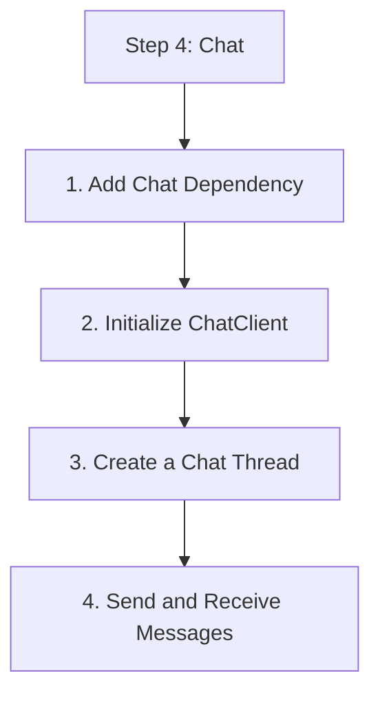

# Step 4: Chat

Learn how to create chat threads, add participants, and send messages.

## 1. Add Chat Dependency

Add the following to your `pom.xml`:

```xml
<dependency>
    <groupId>com.azure</groupId>
    <artifactId>azure-communication-chat</artifactId>
    <version>1.3.0</version>
</dependency>
```

## 2. Initialize ChatClient

Chat operations require a User Access Token (generated in Step 1).

```java
import com.azure.communication.chat.ChatClient;
import com.azure.communication.chat.ChatClientBuilder;
import com.azure.communication.common.CommunicationTokenCredential;

String endpoint = "https://<your-resource>.communication.azure.com";
String userAccessToken = "<user-access-token>";

ChatClient chatClient = new ChatClientBuilder()
    .endpoint(endpoint)
    .credential(new CommunicationTokenCredential(userAccessToken))
    .buildClient();
```

## 3. Create a Chat Thread

Threads are the containers for messages and participants.

```java
import com.azure.communication.chat.models.*;
import java.util.Arrays;

public void createThread() {
    CreateChatThreadOptions options = new CreateChatThreadOptions("General Support")
        .addParticipant(new ChatParticipant()
            .setCommunicationIdentifier(new CommunicationUserIdentifier("<second-user-id>"))
            .setDisplayName("Jane Doe"));

    CreateChatThreadResult result = chatClient.createChatThread(options);
    String threadId = result.getChatThread().getId();
    System.out.println("Thread created with ID: " + threadId);
}
```

## 4. Send and Receive Messages

Use `ChatThreadClient` for operations within a specific thread.

```java
import com.azure.communication.chat.ChatThreadClient;

public void sendMessage(String threadId) {
    ChatThreadClient threadClient = chatClient.getChatThreadClient(threadId);
    
    SendChatMessageOptions options = new SendChatMessageOptions()
        .setContent("Hello everyone!")
        .setType(ChatMessageType.TEXT);

    SendChatMessageResult result = threadClient.sendMessage(options);
    System.out.println("Message sent with ID: " + result.getId());
}

public void listMessages(String threadId) {
    ChatThreadClient threadClient = chatClient.getChatThreadClient(threadId);
    
    threadClient.listMessages().iterableByPage().forEach(page -> {
        page.getElements().forEach(message -> {
            System.out.println(message.getSenderDisplayName() + ": " + message.getContent().getMessage());
        });
    });
}
```

## 5. Manage Participants

```java
public void addParticipant(String threadId, String userId) {
    ChatThreadClient threadClient = chatClient.getChatThreadClient(threadId);
    
    ChatParticipant participant = new ChatParticipant()
        .setCommunicationIdentifier(new CommunicationUserIdentifier(userId))
        .setDisplayName("New Member");

    threadClient.addParticipants(Arrays.asList(participant));
}
```

## Full Code Example

```java
package com.communication.quickstart;

import com.azure.communication.chat.*;
import com.azure.communication.chat.models.*;
import com.azure.communication.common.*;

public class ChatApp {
    public static void main(String[] args) {
        // Initialize client, create thread, and send message
        // Ensure you have valid endpoint and token
    }
}
```

## Next Step

Implement voice features with [Voice Calling](./05-voice-calling.md).

## Page Flow

<!-- diagram-id: 04-chat-page-flow -->


## Review Matrix

| Review area | Page-specific check |
|---|---|
| Scope | Confirm the guidance applies to Step 4: Chat. |
| Source basis | Validate the recommendation against the Microsoft Learn sources in this page. |
| Evidence | Capture command output, portal state, metrics, logs, or screenshots before treating the result as proven. |

## See Also

- [Guide home](../../../index.md)
- [Section index](index.md)
- [Start here](../../../start-here/overview.md)

## Sources
- [Quickstart: Join a chat thread](https://learn.microsoft.com/azure/communication-services/quickstarts/chat/get-started)
