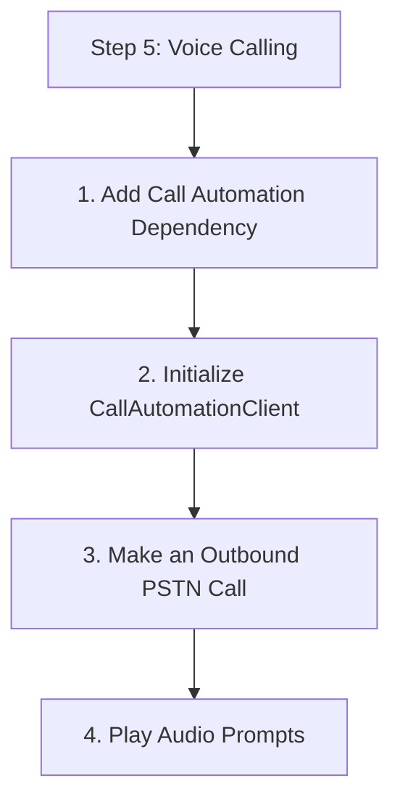

# Step 5: Voice Calling

Use the `CallAutomationClient` to make outbound calls and handle telephony events.

## 1. Add Call Automation Dependency

Add the following to your `pom.xml`:

```xml
<dependency>
    <groupId>com.azure</groupId>
    <artifactId>azure-communication-callautomation</artifactId>
    <version>1.0.0</version>
</dependency>
```

## 2. Initialize CallAutomationClient

```java
import com.azure.communication.callautomation.CallAutomationClient;
import com.azure.communication.callautomation.CallAutomationClientBuilder;

String connectionString = System.getenv("COMMUNICATION_SERVICES_CONNECTION_STRING");
CallAutomationClient callClient = new CallAutomationClientBuilder()
    .connectionString(connectionString)
    .buildClient();
```

## 3. Make an Outbound PSTN Call

You need an ACS phone number and a callback URL to receive events.

```java
import com.azure.communication.callautomation.models.*;
import com.azure.communication.common.PhoneNumberIdentifier;

public void makeCall() {
    PhoneNumberIdentifier target = new PhoneNumberIdentifier("+1234567890");
    PhoneNumberIdentifier caller = new PhoneNumberIdentifier("+10987654321");
    String callbackUrl = "https://your-app.com/callbacks/call";

    CallInvite invite = new CallInvite(target, caller);
    CreateCallResult result = callClient.createCall(invite, callbackUrl);
    
    System.out.println("Call Connection ID: " + result.getCallConnectionProperties().getCallConnectionId());
}
```

## 4. Play Audio Prompts

Once the call is established, you can play audio files to the participant.

```java
import com.azure.communication.callautomation.CallConnection;

public void playAudio(String callConnectionId) {
    CallConnection callConnection = callClient.getCallConnection(callConnectionId);
    
    FileSource audioSource = new FileSource().setUrl("https://storage.com/welcome.wav");
    PlayOptions options = new PlayOptions(audioSource, Arrays.asList(new PhoneNumberIdentifier("+1234567890")));

    callConnection.getCallMedia().play(options);
}
```

## 5. DTMF Recognition (Interactive Voice Response)

Recognize keypad inputs from the user.

```java
public void startRecognition(String callConnectionId) {
    CallConnection callConnection = callClient.getCallConnection(callConnectionId);
    
    DtmfConfigurations config = new DtmfConfigurations()
        .setMaxDigitsToCollect(1)
        .setInterDigitTimeoutInSeconds(5);

    CallMediaRecognizeDtmfOptions options = new CallMediaRecognizeDtmfOptions(
        new PhoneNumberIdentifier("+1234567890"), 1)
        .setInterDigitTimeout(Duration.ofSeconds(5));

    callConnection.getCallMedia().startRecognizing(options);
}
```

## Full Code Example

```java
package com.communication.quickstart;

import com.azure.communication.callautomation.*;
import com.azure.communication.callautomation.models.*;
import com.azure.communication.common.*;

public class VoiceApp {
    public static void main(String[] args) {
        // Implementation for outbound call and event handling
    }
}
```

## Next Step

Implement [Logging & Monitoring](./06-logging-monitoring.md) for your application.

## Page Flow

<!-- diagram-id: 05-voice-calling-page-flow -->


## Review Matrix

| Review area | Page-specific check |
|---|---|
| Scope | Confirm the guidance applies to Step 5: Voice Calling. |
| Source basis | Validate the recommendation against the Microsoft Learn sources in this page. |
| Evidence | Capture command output, portal state, metrics, logs, or screenshots before treating the result as proven. |

## See Also

- [Guide home](../../../index.md)
- [Section index](index.md)
- [Start here](../../../start-here/overview.md)

## Sources
- [Quickstart: Make an outbound call using Call Automation](https://learn.microsoft.com/azure/communication-services/quickstarts/call-automation/quickstart-make-an-outbound-call)
