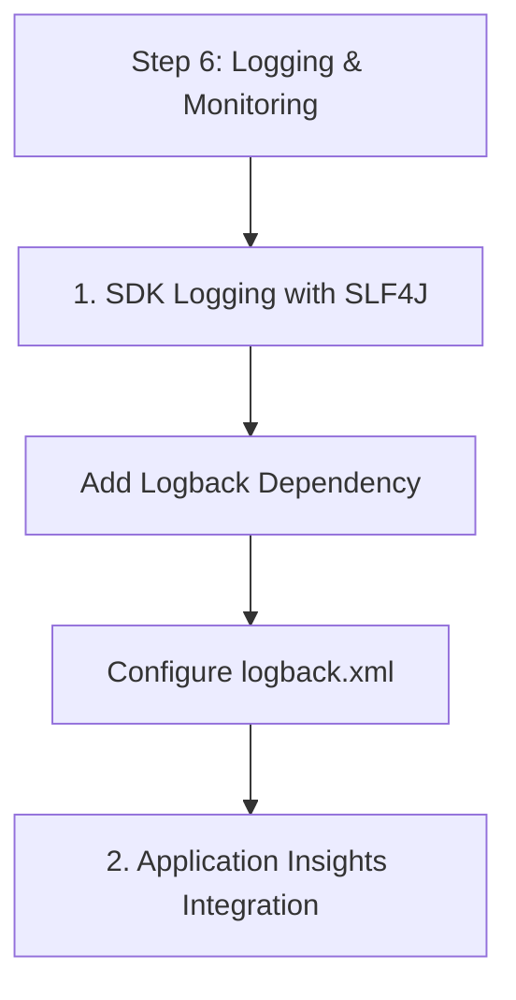

# Step 6: Logging & Monitoring

Observability is crucial for production communication apps. This step covers SDK logging and Azure Monitor integration.

## 1. SDK Logging with SLF4J

The Azure SDK for Java uses SLF4J for logging. You can use Logback or Log4j2 as your logging implementation.

### Add Logback Dependency
```xml
<dependency>
    <groupId>ch.qos.logback</groupId>
    <artifactId>logback-classic</artifactId>
    <version>1.4.11</version>
</dependency>
```

### Configure logback.xml
Place this in `src/main/resources/logback.xml` to capture SDK logs.

```xml
<configuration>
  <appender name="STDOUT" class="ch.qos.logback.core.ConsoleAppender">
    <encoder>
      <pattern>%d{HH:mm:ss.SSS} [%thread] %-5level %logger{36} - %msg%n</pattern>
    </encoder>
  </appender>

  <logger name="com.azure.communication" level="DEBUG" />

  <root level="INFO">
    <appender-ref ref="STDOUT" />
  </root>
</configuration>
```

## 2. Application Insights Integration

Use the Application Insights Java agent for zero-code telemetry collection.

### Download the Agent
Download `applicationinsights-agent-3.x.x.jar` and run your app with the following JVM argument:

```bash
java -javaagent:path/to/applicationinsights-agent.jar -jar my-app.jar
```

### Configure Connection String
Set the `APPLICATIONINSIGHTS_CONNECTION_STRING` environment variable.

## 3. Custom Telemetry

You can manually track events using the Application Insights SDK.

```xml
<dependency>
    <groupId>com.microsoft.azure</groupId>
    <artifactId>applicationinsights-core</artifactId>
    <version>3.4.19</version>
</dependency>
```

```java
import com.microsoft.applicationinsights.TelemetryClient;

TelemetryClient telemetry = new TelemetryClient();
telemetry.trackEvent("SMSSent");
```

## 4. Azure Monitor Diagnostic Settings

Enable diagnostic settings in the Azure Portal for your ACS resource to send logs to a Log Analytics workspace.

- **Storage**: Retain logs for compliance.
- **Log Analytics**: Query logs using KQL.
- **Event Hub**: Stream logs to third-party tools.

## Next Step

Finalize your solution with [Infrastructure as Code](./07-infrastructure-as-code.md).

## Page Flow

<!-- diagram-id: 06-logging-monitoring-page-flow -->


## Review Matrix

| Review area | Page-specific check |
|---|---|
| Scope | Confirm the guidance applies to Step 6: Logging & Monitoring. |
| Source basis | Validate the recommendation against the Microsoft Learn sources in this page. |
| Evidence | Capture command output, portal state, metrics, logs, or screenshots before treating the result as proven. |

## See Also

- [Guide home](../../../index.md)
- [Section index](index.md)
- [Start here](../../../start-here/overview.md)

## Sources
- [Azure Communication Services Logs](https://learn.microsoft.com/azure/communication-services/concepts/logging-and-diagnostics)
- [Configure Azure SDK for Java logging](https://learn.microsoft.com/en-us/azure/developer/java/sdk/logging-overview)
