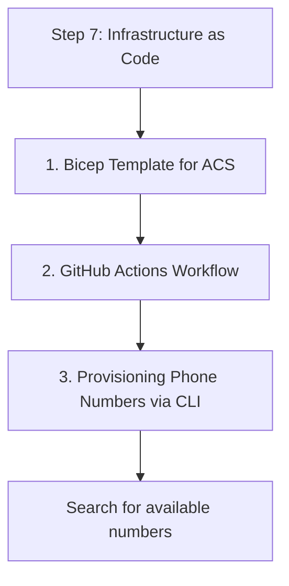

# Step 7: Infrastructure as Code

Automating resource provisioning ensures consistency across environments. This step covers Bicep templates and CI/CD integration.

## 1. Bicep Template for ACS

Create a file named `main.bicep` to define your Communication Services resource.

```bicep
param location string = 'global'
param resourceName string = 'my-acs-resource'

resource acsResource 'Microsoft.Communication/CommunicationServices@2023-03-31' = {
  name: resourceName
  location: location
  properties: {
    dataLocation: 'United States'
  }
}

output acsId string = acsResource.id
```

Deploy using Azure CLI:
```bash
az deployment group create --resource-group MyRG --template-file main.bicep
```

## 2. GitHub Actions Workflow

Automate your Maven build and deployment using GitHub Actions. Create `.github/workflows/main.yml`.

```yaml
name: Java CI/CD

on:
  push:
    branches: [ main ]

jobs:
  build:
    runs-on: ubuntu-latest
    steps:
    - uses: actions/checkout@v3
    
    - name: Set up JDK 17
      uses: actions/setup-java@v3
      with:
        java-version: '17'
        distribution: 'temurin'
        cache: maven
        
    - name: Build with Maven
      run: mvn -B package --file pom.xml

    - name: Azure Login
      uses: azure/login@v1
      with:
        creds: ${{ secrets.AZURE_CREDENTIALS }}

    - name: Deploy Bicep
      run: |
        az deployment group create \
          --resource-group ${{ secrets.AZURE_RG }} \
          --template-file ./main.bicep
```

## 3. Provisioning Phone Numbers via CLI

You can automate phone number acquisition (where supported) using the Azure CLI.

```bash
# Search for available numbers
az communication phonenumber search-available \
    --area-code "425" \
    --country-code "US" \
    --phone-plan-ids "plan-id" \
    --quantity 1

# Purchase a number
az communication phonenumber purchase \
    --search-id "search-id-from-previous-step"
```

## 4. Maven Plugin for Azure App Service

If you are deploying a web application, use the Maven plugin for Azure App Service.

```xml
<plugin>
    <groupId>com.microsoft.azure</groupId>
    <artifactId>azure-webapp-maven-plugin</artifactId>
    <version>2.12.0</version>
    <configuration>
        <schemaVersion>v2</schemaVersion>
        <resourceGroup>my-resource-group</resourceGroup>
        <appName>my-acs-java-app</appName>
        <region>westus</region>
        <runtime>
            <os>linux</os>
            <javaVersion>Java 17</javaVersion>
            <webContainer>Java SE</webContainer>
        </runtime>
    </configuration>
</plugin>
```

## Summary

Congratulations! You have built a complete communication application with Java, from local setup to automated deployment.

## Page Flow

<!-- diagram-id: 07-infrastructure-as-code-page-flow -->


## Review Matrix

| Review area | Page-specific check |
|---|---|
| Scope | Confirm the guidance applies to Step 7: Infrastructure as Code. |
| Source basis | Validate the recommendation against the Microsoft Learn sources in this page. |
| Evidence | Capture command output, portal state, metrics, logs, or screenshots before treating the result as proven. |

## See Also

- [Guide home](../../../index.md)
- [Section index](index.md)
- [Start here](../../../start-here/overview.md)

## Sources
- [Bicep documentation](https://learn.microsoft.com/azure/azure-resource-manager/bicep/)
- [GitHub Actions for Azure](https://github.com/Azure/actions)
