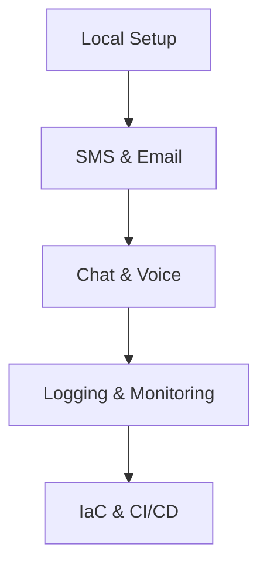

# Java SDK Tutorial

This tutorial series walks you through building a comprehensive communication application using the Azure Communication Services Java SDK.

## What You'll Build

You will create a Java application that can:
- Generate identity tokens for users.
- Send SMS and Email notifications.
- Manage real-time Chat threads.
- Automate voice calls with DTMF recognition.
- Deploy and monitor the solution.

## Prerequisites

- JDK 8 or higher.
- Apache Maven.
- An Azure account with an active subscription.

## Tutorial Steps

| Step | Focus | Description |
| --- | --- | --- |
| [01. Local Setup](./01-local-setup.md) | **Infrastructure** | Environment config, Maven dependencies, and identity verification. |
| [02. Send SMS](./02-send-sms.md) | **Messaging** | Sending messages to single and multiple recipients. |
| [03. Send Email](./03-send-email.md) | **Messaging** | Sending HTML emails with attachments and polling status. |
| [04. Chat](./04-chat.md) | **Real-time** | Creating threads, adding participants, and messaging. |
| [05. Voice Calling](./05-voice-calling.md) | **Telephony** | Outbound calls, answering, and playing audio prompts. |
| [06. Logging & Monitoring](./06-logging-monitoring.md) | **Operations** | SLF4J logging and Application Insights integration. |
| [07. Infrastructure as Code](./07-infrastructure-as-code.md) | **DevOps** | Bicep templates and CI/CD with GitHub Actions. |

## Learning Path

<!-- diagram-id: java-tutorial-path -->

## Sources
- [Azure Communication Services Documentation](https://learn.microsoft.com/azure/communication-services/)
