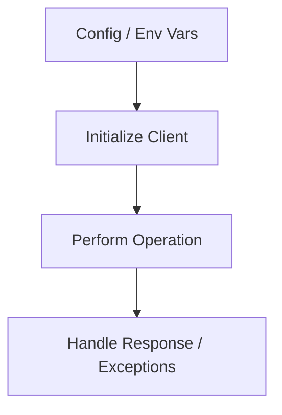

# JavaScript SDK Guide

The Azure Communication Services (ACS) JavaScript SDK provides comprehensive tools for building communication features in web browsers and Node.js applications.

## SDK Packages

The SDK is modular, allowing you to install only the features you need.

| Feature | Package |
| --- | --- |
| **Identity** | `@azure/communication-identity` |
| **SMS** | `@azure/communication-sms` |
| **Email** | `@azure/communication-email` |
| **Chat** | `@azure/communication-chat` |
| **Calling (Client)** | `@azure/communication-calling` |
| **UI Library** | `@azure/communication-react` |
| **Phone Numbers** | `@azure/communication-phone-numbers` |
| **Call Automation** | `@azure/communication-call-automation` |

## Prerequisites

- Node.js 18 or later
- npm or yarn
- An active Azure subscription
- An ACS resource (see [Local Setup](./tutorial/01-local-setup.md))

## Quick Start: Send SMS (Node.js)

```javascript
const { SmsClient } = require("@azure/communication-sms");

const connectionString = "YOUR_CONNECTION_STRING";
const smsClient = new SmsClient(connectionString);

async function main() {
  const sendResults = await smsClient.send({
    from: "<registered-phone-number>",
    to: ["<recipient-phone-number>"],
    message: "Hello from ACS JavaScript SDK!"
  });

  for (const sendResult of sendResults) {
    if (sendResult.successful) {
      console.log("Success: ", sendResult.messageId);
    } else {
      console.error("Error: ", sendResult.errorMessage);
    }
  }
}

main();
```

## SDK Workflow

The general workflow for ACS JavaScript SDKs involves initializing a client and performing operations using that client.

<!-- diagram-id: javascript-sdk-workflow -->


## Unique Feature: Browser-based Calling

Unlike the Python SDK, the JavaScript SDK provides a specialized library for browser-based voice and video calling, including pre-built UI components.

- **[Calling UI Library](./recipes/calling-ui-composite.md)**: Add video calling with minimal code.
- **[Voice & Video Calling](./tutorial/05-video-calling.md)**: Full control over media streams.

## Explore More

- **[Tutorials](./tutorial/index.md)**: Step-by-step guides for common scenarios.
- **[Recipes](./recipes/index.md)**: Focused code snippets for specific tasks.

## Sources
- [JavaScript SDK Reference](https://learn.microsoft.com/javascript/api/overview/azure/communication-services)
