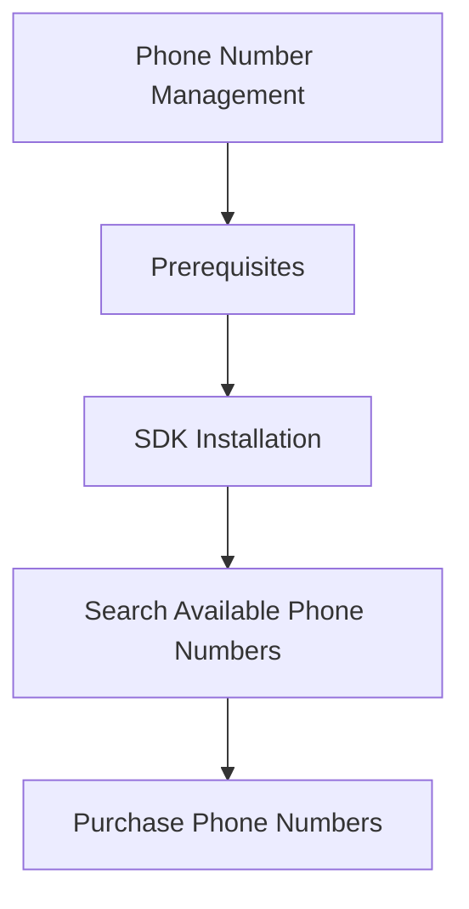

# Phone Number Management

This recipe shows how to search, purchase, and release Azure Communication Services (ACS) phone numbers using the JavaScript SDK.

## Prerequisites

- [ACS Resource](https://learn.microsoft.com/azure/communication-services/quickstarts/create-communication-resource).
- [Managed Identity](https://learn.microsoft.com/azure/active-directory/managed-identities-azure-resources/overview) or connection string.

## SDK Installation

```bash
npm install @azure/communication-phone-numbers
```

## Search Available Phone Numbers

```javascript
const { PhoneNumbersClient } = require("@azure/communication-phone-numbers");
const { DefaultAzureCredential } = require("@azure/identity");

// Initialize client
const endpoint = process.env.COMMUNICATION_SERVICES_ENDPOINT;
const client = new PhoneNumbersClient(endpoint, new DefaultAzureCredential());

async function searchPhoneNumbers() {
  // Search for available phone numbers in the US with SMS capabilities
  const searchPoller = await client.beginSearchAvailablePhoneNumbers({
    areaCode: "425",
    countryCode: "US",
    phoneNumberType: "geographic",
    assignmentType: "person",
    capabilities: { sms: "inbound+outbound", calling: "none" },
    quantity: 1
  });

  const searchResult = await searchPoller.pollUntilDone();
  console.log(`Found phone number: ${searchResult.phoneNumbers[0]}`);
  console.log(`Search ID: ${searchResult.searchId}`);
}

searchPhoneNumbers();
```

## Purchase Phone Numbers

```javascript
async function purchasePhoneNumber(searchId) {
  // Purchase the phone number (uncomment carefully)
  // const purchasePoller = await client.beginPurchasePhoneNumbers(searchId);
  // await purchasePoller.pollUntilDone();
  // console.log("Phone number purchased successfully!");
}
```

## Configure Capabilities

```javascript
async function updateCapabilities(phoneNumber) {
  // Update capabilities for a specific phone number
  // const updatePoller = await client.beginUpdatePhoneNumberCapabilities(
  //     phoneNumber,
  //     { sms: "inbound+outbound", calling: "none" }
  // );
  // await updatePoller.pollUntilDone();
  // console.log("Phone number capabilities updated!");
}
```

## Release Phone Numbers

```javascript
async function releasePhoneNumber(phoneNumber) {
  // Release a phone number (uncomment carefully)
  // const releasePoller = await client.beginReleasePhoneNumber(phoneNumber);
  // await releasePoller.pollUntilDone();
  // console.log("Phone number released successfully!");
}
```

## List Purchased Phone Numbers

```javascript
async function listPhoneNumbers() {
  // List all purchased phone numbers
  const purchasedNumbers = client.listPurchasedPhoneNumbers();
  for await (const number of purchasedNumbers) {
    console.log(`Phone number: ${number.phoneNumber}, Type: ${number.phoneNumberType}`);
  }
}

listPhoneNumbers();
```

## Page Flow

<!-- diagram-id: phone-number-management-page-flow -->


## Review Matrix

| Review area | Page-specific check |
|---|---|
| Scope | Confirm the guidance applies to Phone Number Management. |
| Source basis | Validate the recommendation against the Microsoft Learn sources in this page. |
| Evidence | Capture command output, portal state, metrics, logs, or screenshots before treating the result as proven. |

## See Also
- [ACS Phone Number Concepts](https://learn.microsoft.com/en-us/azure/communication-services/quickstarts/telephony/get-phone-number)
- [ACS Telephony Pricing](https://azure.microsoft.com/pricing/details/communication-services/)

## Sources
- [Azure Communication Phone Numbers client library for JavaScript](https://learn.microsoft.com/javascript/api/overview/azure/communication-phone-numbers-readme)
