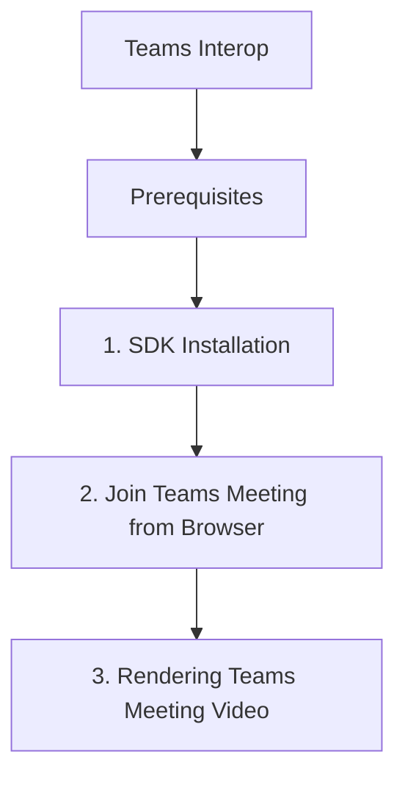

# Teams Interop

This recipe demonstrates how to join Microsoft Teams meetings from a web browser application using the Azure Communication Services (ACS) Calling SDK.

## Prerequisites

- [ACS Resource](https://learn.microsoft.com/azure/communication-services/quickstarts/create-communication-resource).
- [Microsoft Teams Meeting](https://learn.microsoft.com/en-us/azure/communication-services/concepts/join-teams-meeting).
- [Managed Identity](https://learn.microsoft.com/azure/active-directory/managed-identities-azure-resources/overview) or connection string.
- ACS access token with 'voip' scope.

## 1. SDK Installation

```bash
npm install @azure/communication-calling @azure/communication-common
```

## 2. Join Teams Meeting from Browser

To join a Teams meeting, use the `callAgent.join` method and provide the Teams meeting URL.

```javascript
import { CallClient } from "@azure/communication-calling";
import { AzureCommunicationTokenCredential } from "@azure/communication-common";

async function joinTeamsMeeting() {
  const tokenCredential = new AzureCommunicationTokenCredential("<access-token>");
  const callClient = new CallClient();
  const callAgent = await callClient.createCallAgent(tokenCredential);

  const meetingUrl = "https://teams.microsoft.com/l/meetup-join/19%3ameeting_MT...%40thread.v2/0?context=%7b%22Tid%22%3a%22...%22%2c%22Oid%22%3a%22...%22%7d";

  const call = callAgent.join({ meetingLink: meetingUrl });

  call.on("stateChanged", () => {
    console.log(`Call state changed: ${call.state}`);
  });
}

joinTeamsMeeting();
```

## 3. Rendering Teams Meeting Video

Once the call is established, render the remote video streams as you would in a regular ACS call.

```javascript
call.on("remoteParticipantsUpdated", (e) => {
    e.added.forEach(participant => {
        participant.on("videoStreamsUpdated", (ev) => {
            ev.added.forEach(stream => {
                if (stream.isAvailable) {
                    renderRemoteStream(stream);
                }
            });
        });
    });
});
```

## 4. Teams User Identity Mapping

You can also join as a Teams user by providing a Microsoft Entra ID (formerly Azure AD) token. This requires a different credential type.

```javascript
import { MicrosoftTeamsCredential } from "@azure/communication-common";

const entraIdToken = "<microsoft-entra-id-token>";
const teamsCredential = new MicrosoftTeamsCredential(entraIdToken);

const callAgent = await callClient.createTeamsCallAgent(teamsCredential);

// Join the meeting as a Teams user
const call = callAgent.join({ meetingLink: meetingUrl });
```

## 5. Security and Compliance

- Ensure your ACS resource is configured to allow Teams interop.
- Follow Microsoft's guidelines for handling Teams data and identities.
- Implement proper authentication and authorization to protect meeting access.

## 6. Best Practices

- Use the latest version of the ACS Calling SDK.
- Test your interop scenarios with different Teams meeting types (e.g., scheduled, ad-hoc).
- Monitor your ACS and Teams usage for any unexpected issues.

## Page Flow

<!-- diagram-id: teams-interop-page-flow -->


## Review Matrix

| Review area | Page-specific check |
|---|---|
| Scope | Confirm the guidance applies to Teams Interop. |
| Source basis | Validate the recommendation against the Microsoft Learn sources in this page. |
| Evidence | Capture command output, portal state, metrics, logs, or screenshots before treating the result as proven. |

## See Also
- [Teams Interoperability Concepts](https://learn.microsoft.com/azure/communication-services/concepts/teams-interop)
- [Calling UI Composite Recipe](./calling-ui-composite.md)

## Sources
- [Azure Communication Calling client library for JavaScript](https://learn.microsoft.com/en-us/azure/communication-services/quickstarts/voice-video-calling/getting-started-with-calling)
