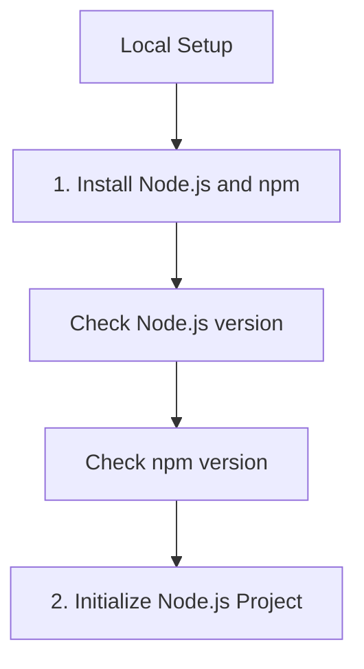

# Local Setup

In this step, we'll configure your local development environment to use the Azure Communication Services (ACS) JavaScript SDK.

## 1. Install Node.js and npm

Ensure you have Node.js 18 or later and npm (installed with Node.js) or yarn installed.

```bash
# Check Node.js version
node --version

# Check npm version
npm --version
```

## 2. Initialize Node.js Project

Create a new directory for your project and initialize it with npm.

```bash
mkdir acs-js-tutorial
cd acs-js-tutorial
npm init -y
```

## 3. Install ACS SDK Packages

Install the necessary ACS SDK packages via npm.

```bash
npm install @azure/communication-identity @azure/communication-sms @azure/communication-email @azure/communication-chat @azure/communication-calling @azure/communication-phone-numbers
```

## 4. Create ACS Resource in Azure

1. Log in to the [Azure Portal](https://portal.azure.com/).
2. Click **Create a resource** and search for **Communication Services**.
3. Fill in the required details:
    - **Resource Group**: Create a new or use an existing one.
    - **Resource Name**: Choose a unique name.
    - **Data Location**: Select a location near you.
4. Click **Review + create** and then **Create**.

## 5. Get Connection String

1. Once the resource is deployed, navigate to it in the Azure Portal.
2. Under **Settings**, select **Keys**.
3. Copy the **Connection string** for the primary key.

## 6. Set Up Environment Variables

It's best practice to store sensitive information in environment variables.

```bash
# Linux/MacOS
export COMMUNICATION_SERVICES_CONNECTION_STRING="<your-connection-string>"

# Windows
# setx COMMUNICATION_SERVICES_CONNECTION_STRING "<your-connection-string>"
```

## 7. Verify with Simple Identity Token Creation

Create a file named `identity_token.js` and add the following code to verify your setup.

```javascript
const { CommunicationIdentityClient } = require("@azure/communication-identity");

async function main() {
  try {
    const connectionString = process.env.COMMUNICATION_SERVICES_CONNECTION_STRING;
    if (!connectionString) {
      console.log("Please set the COMMUNICATION_SERVICES_CONNECTION_STRING environment variable.");
      return;
    }

    // Initialize the client
    const client = new CommunicationIdentityClient(connectionString);

    // Create a new user identity
    const user = await client.createUser();
    console.log(`Created a new user identity: ${user.communicationUserId}`);

    // Issue an access token for the user with 'chat' and 'voip' scopes
    const tokenResult = await client.getToken(user, ["chat", "voip"]);
    console.log(`Issued an access token: ${tokenResult.token}`);
    console.log(`Token expires at: ${tokenResult.expiresOn}`);

  } catch (error) {
    console.error(`An error occurred: ${error.message}`);
  }
}

main();
```

Run the script to verify your connection:

```bash
node identity_token.js
```

## Page Flow

<!-- diagram-id: 01-local-setup-page-flow -->


## Review Matrix

| Review area | Page-specific check |
|---|---|
| Scope | Confirm the guidance applies to Local Setup. |
| Source basis | Validate the recommendation against the Microsoft Learn sources in this page. |
| Evidence | Capture command output, portal state, metrics, logs, or screenshots before treating the result as proven. |

## See Also
- [Create and manage ACS resources](https://learn.microsoft.com/azure/communication-services/quickstarts/create-communication-resource)
- [Manage user access tokens](https://learn.microsoft.com/en-us/azure/communication-services/quickstarts/identity/access-tokens)

## Sources
- [Azure Communication Identity client library for JavaScript](https://learn.microsoft.com/javascript/api/overview/azure/communication-identity-readme)
