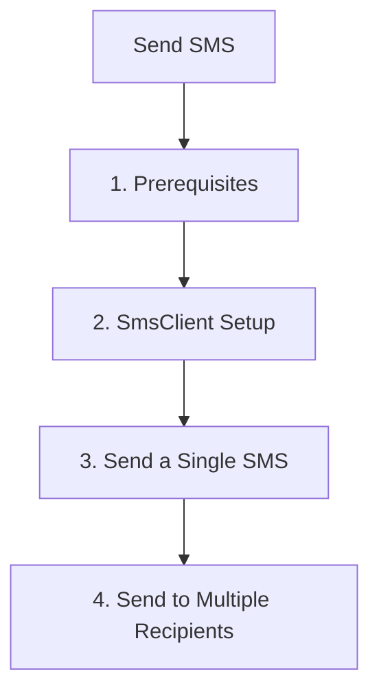

# Send SMS

This step demonstrates how to use the Azure Communication Services (ACS) JavaScript SDK to send SMS messages.

## 1. Prerequisites

- Complete the [Local Setup](./01-local-setup.md).
- Have a registered phone number in your ACS resource.

## 2. SmsClient Setup

Initialize the `SmsClient` using the connection string from your environment variables.

```javascript
const { SmsClient } = require("@azure/communication-sms");

const connectionString = process.env.COMMUNICATION_SERVICES_CONNECTION_STRING;
const smsClient = new SmsClient(connectionString);
```

## 3. Send a Single SMS

To send a message, provide the sender's phone number, the recipient's phone number, and the message content.

```javascript
async function sendSingleSms() {
  const sendResults = await smsClient.send({
    from: "<registered-phone-number>",
    to: ["<recipient-phone-number>"],
    message: "Hello from ACS JavaScript SDK!"
  });

  for (const sendResult of sendResults) {
    if (sendResult.successful) {
      console.log(`Message sent to ${sendResult.to}. Message ID: ${sendResult.messageId}`);
    } else {
      console.error(`Failed to send message to ${sendResult.to}. Error: ${sendResult.errorMessage}`);
    }
  }
}

sendSingleSms();
```

## 4. Send to Multiple Recipients

The `to` parameter accepts a list of phone numbers, allowing you to send messages in bulk.

```javascript
async function sendBulkSms() {
  const recipients = ["<recipient-phone-number-1>", "<recipient-phone-number-2>"];

  const sendResults = await smsClient.send({
    from: "<registered-phone-number>",
    to: recipients,
    message: "Bulk message from ACS JavaScript SDK!"
  });

  for (const result of sendResults) {
    console.log(`Status for ${result.to}: ${result.successful ? 'Success' : 'Failure'}`);
  }
}

sendBulkSms();
```

## 5. Delivery Report Handling

ACS provides delivery reports via Event Grid. While the SDK itself doesn't "handle" the report, it provides the `messageId` you'll need to correlate reports.

!!! info "Important"
    Delivery reports are typically handled via webhooks or Event Grid subscriptions. See the [Event Grid Webhooks Recipe](../recipes/event-grid-webhooks.md) for more.

## 6. Error Handling Patterns

It's essential to handle potential exceptions, such as network issues or invalid phone numbers.

```javascript
async function sendWithErrors() {
  try {
    const sendResults = await smsClient.send({
      from: "<registered-phone-number>",
      to: ["<recipient-phone-number>"],
      message: "Testing error handling."
    });
  } catch (error) {
    console.error(`An error occurred while sending SMS: ${error.message}`);
  }
}

sendWithErrors();
```

## Full Code Example

Create a file named `send_sms.js` with the following content:

```javascript
const { SmsClient } = require("@azure/communication-sms");

async function main() {
  try {
    const connectionString = process.env.COMMUNICATION_SERVICES_CONNECTION_STRING;
    if (!connectionString) {
      console.log("Please set the COMMUNICATION_SERVICES_CONNECTION_STRING environment variable.");
      return;
    }

    const smsClient = new SmsClient(connectionString);

    // Replace with your registered number and recipient number
    const fromNumber = "<registered-phone-number>";
    const toNumber = ["<recipient-phone-number>"];
    
    const sendResults = await smsClient.send({
      from: fromNumber,
      to: toNumber,
      message: "Hello from ACS JavaScript SDK tutorial!"
    });

    for (const result of sendResults) {
      if (result.successful) {
        console.log(`Message ID: ${result.messageId}`);
      } else {
        console.error(`Error: ${result.errorMessage}`);
      }
    }

  } catch (error) {
    console.error(`Exception: ${error.message}`);
  }
}

main();
```

## Page Flow

<!-- diagram-id: 02-send-sms-page-flow -->


## Review Matrix

| Review area | Page-specific check |
|---|---|
| Scope | Confirm the guidance applies to Send SMS. |
| Source basis | Validate the recommendation against the Microsoft Learn sources in this page. |
| Evidence | Capture command output, portal state, metrics, logs, or screenshots before treating the result as proven. |

## See Also
- [SMS Troubleshooting](https://learn.microsoft.com/en-us/azure/communication-services/concepts/sms/concepts)
- [SMS Delivery Reports](https://learn.microsoft.com/en-us/azure/communication-services/concepts/sms/concepts)

## Sources
- [Azure Communication SMS client library for JavaScript](https://learn.microsoft.com/javascript/api/overview/azure/communication-sms-readme)
