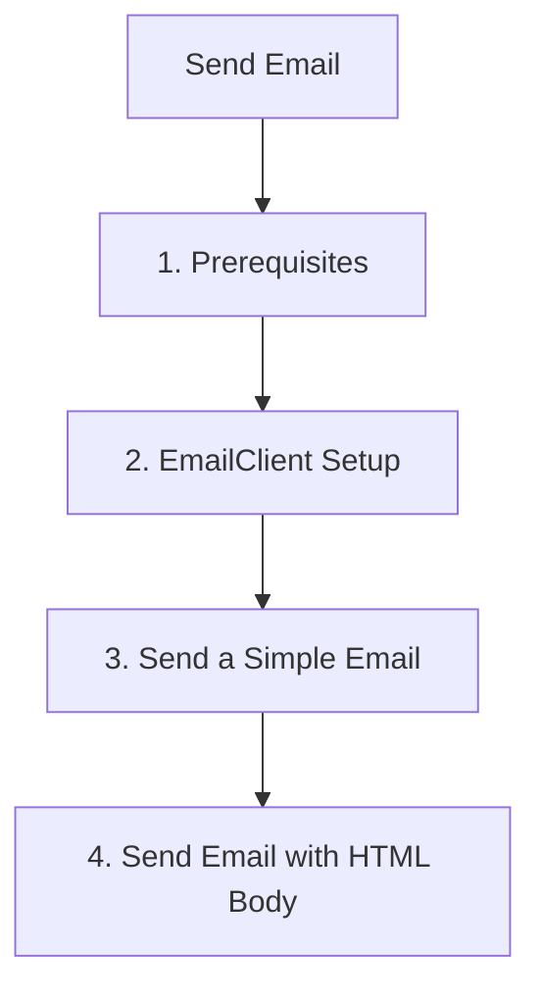

# Send Email

This step demonstrates how to use the Azure Communication Services (ACS) JavaScript SDK to send emails.

## 1. Prerequisites

- Complete the [Local Setup](./01-local-setup.md).
- Have a verified domain in your ACS resource.

## 2. EmailClient Setup

Initialize the `EmailClient` using the connection string.

```javascript
const { EmailClient } = require("@azure/communication-email");

const connectionString = process.env.COMMUNICATION_SERVICES_CONNECTION_STRING;
const emailClient = new EmailClient(connectionString);
```

## 3. Send a Simple Email

Provide the sender's email address, recipient's email address, subject, and message content.

```javascript
async function sendSimpleEmail() {
  const message = {
    senderAddress: "<verified-sender-email-address>",
    content: {
      subject: "Hello from ACS Email SDK!",
      plainText: "This is a plain text email message sent with ACS JavaScript SDK."
    },
    recipients: {
      to: [{ address: "<recipient-email-address>" }]
    }
  };

  const poller = await emailClient.beginSend(message);
  const result = await poller.pollUntilDone();
  console.log(`Message ID: ${result.messageId}`);
}

sendSimpleEmail();
```

## 4. Send Email with HTML Body

You can send HTML-formatted emails by providing the `html` content.

```javascript
async function sendHtmlEmail() {
  const message = {
    senderAddress: "<verified-sender-email-address>",
    content: {
      subject: "HTML Email from ACS Email SDK!",
      html: "<html><body><h1>Hello!</h1><p>This is an HTML email sent with ACS JavaScript SDK.</p></body></html>"
    },
    recipients: {
      to: [{ address: "<recipient-email-address>" }]
    }
  };

  const poller = await emailClient.beginSend(message);
  const result = await poller.pollUntilDone();
  console.log(`Message ID: ${result.messageId}`);
}

sendHtmlEmail();
```

## 5. Send with Attachments

To send an email with attachments, provide the `attachments` list in the message object.

```javascript
const fs = require("fs");

async function sendEmailWithAttachment() {
  const fileContents = fs.readFileSync("sample.txt");
  const contentBytes = fileContents.toString("base64");

  const message = {
    senderAddress: "<verified-sender-email-address>",
    content: {
      subject: "Email with Attachment from ACS Email SDK!",
      plainText: "This email contains an attachment."
    },
    recipients: {
      to: [{ address: "<recipient-email-address>" }]
    },
    attachments: [
      {
        name: "sample.txt",
        contentType: "text/plain",
        contentInBase64: contentBytes
      }
    ]
  };

  const poller = await emailClient.beginSend(message);
  const result = await poller.pollUntilDone();
  console.log(`Message ID: ${result.messageId}`);
}

sendEmailWithAttachment();
```

## 6. Poll for Delivery Status

The `beginSend` method returns a poller object that you can use to check the status of the email delivery.

```javascript
async function pollForStatus() {
  const poller = await emailClient.beginSend(message);
  
  // You can also manually check the status
  const state = poller.getOperationState();
  console.log(`Current status: ${state.status}`);

  const result = await poller.pollUntilDone();
  console.log(`Status of email send: ${result.status}`);
}
```

## Full Code Example

Create a file named `send_email.js` with the following content:

```javascript
const { EmailClient } = require("@azure/communication-email");

async function main() {
  try {
    const connectionString = process.env.COMMUNICATION_SERVICES_CONNECTION_STRING;
    if (!connectionString) {
      console.log("Please set the COMMUNICATION_SERVICES_CONNECTION_STRING environment variable.");
      return;
    }

    const emailClient = new EmailClient(connectionString);

    const message = {
      senderAddress: "<verified-sender-email-address>",
      content: {
        subject: "Hello from ACS Email SDK tutorial!",
        plainText: "This is a message sent from the ACS JavaScript SDK tutorial."
      },
      recipients: {
        to: [{ address: "<recipient-email-address>" }]
      }
    };

    const poller = await emailClient.beginSend(message);
    const result = await poller.pollUntilDone();
    console.log(`Message ID: ${result.messageId}`);

  } catch (error) {
    console.error(`Exception: ${error.message}`);
  }
}

main();
```

## Page Flow

<!-- diagram-id: 03-send-email-page-flow -->


## Review Matrix

| Review area | Page-specific check |
|---|---|
| Scope | Confirm the guidance applies to Send Email. |
| Source basis | Validate the recommendation against the Microsoft Learn sources in this page. |
| Evidence | Capture command output, portal state, metrics, logs, or screenshots before treating the result as proven. |

## See Also
- [Email Troubleshooting](https://learn.microsoft.com/en-us/azure/communication-services/concepts/email/prepare-email-communication-resource)
- [Email Delivery Reports](https://learn.microsoft.com/en-us/azure/communication-services/concepts/email/prepare-email-communication-resource)

## Sources
- [Azure Communication Email client library for JavaScript](https://learn.microsoft.com/javascript/api/overview/azure/communication-email-readme)
