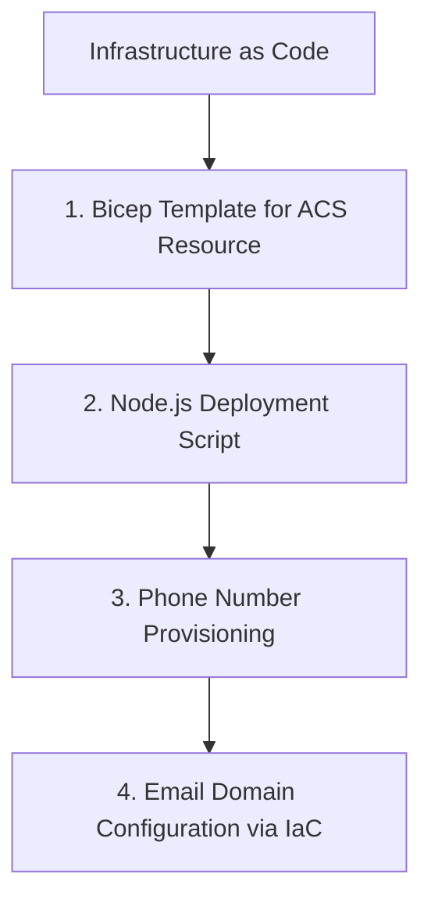

# Infrastructure as Code

This step shows how to use Bicep and Node.js to deploy and manage Azure Communication Services (ACS) resources.

## 1. Bicep Template for ACS Resource

Create a file named `acs-resource.bicep` with the following content.

```bicep
param communicationServicesName string = 'acs-tutorial-resource'
param dataLocation string = 'United States'

resource communicationService 'Microsoft.Communication/CommunicationServices@2023-03-31' = {
  name: communicationServicesName
  location: 'global'
  properties: {
    dataLocation: dataLocation
  }
}

output acsResourceId string = communicationService.id
```

## 2. Node.js Deployment Script

Use the `@azure/arm-resources` and `@azure/identity` Node.js packages to deploy the Bicep template.

```bash
npm install @azure/arm-resources @azure/identity
```

```javascript
const { DefaultAzureCredential } = require("@azure/identity");
const { ResourceManagementClient } = require("@azure/arm-resources");
const fs = require("fs");

async function deployAcs() {
  const subscriptionId = process.env.AZURE_SUBSCRIPTION_ID;
  const resourceGroupName = "acs-tutorial-rg";
  const deploymentName = "acs-deployment";

  // Initialize credential and client
  const credential = new DefaultAzureCredential();
  const resourceClient = new ResourceManagementClient(credential, subscriptionId);

  // Load Bicep file (compiled to JSON or use Bicep CLI to compile)
  // For this example, assume a JSON-compiled template
  const templateJson = JSON.parse(fs.readFileSync("acs-resource.json", "utf8"));

  // Deploy the template
  const deploymentProperties = {
    properties: {
      mode: "Incremental",
      template: templateJson,
      parameters: {
        communicationServicesName: { value: "acs-js-tutorial" }
      }
    }
  };

  const result = await resourceClient.deployments.beginCreateOrUpdate(
    resourceGroupName,
    deploymentName,
    deploymentProperties
  );

  const deploymentResult = await result.pollUntilDone();
  console.log(`Deployment status: ${deploymentResult.properties.provisioningState}`);
}

deployAcs();
```

## 3. Phone Number Provisioning

You can automate phone number search and purchase using the `@azure/communication-phone-numbers` SDK.

```javascript
const { PhoneNumbersClient } = require("@azure/communication-phone-numbers");
const { DefaultAzureCredential } = require("@azure/identity");

const endpoint = "https://<your-acs-resource-name>.communication.azure.com";
const client = new PhoneNumbersClient(endpoint, new DefaultAzureCredential());

async function provisionPhoneNumber() {
  // Search for available phone numbers
  const searchPoller = await client.beginSearchAvailablePhoneNumbers({
    areaCode: "425",
    countryCode: "US",
    phoneNumberType: "geographic",
    assignmentType: "person",
    capabilities: { sms: "inbound+outbound", calling: "none" },
    quantity: 1
  });

  const searchResult = await searchPoller.pollUntilDone();
  console.log(`Found phone number: ${searchResult.phoneNumbers[0]}`);

  // Purchase the phone number (uncomment carefully)
  // const purchasePoller = await client.beginPurchasePhoneNumbers(searchResult.searchId);
  // await purchasePoller.pollUntilDone();
  // console.log("Phone number purchased successfully!");
}
```

## 4. Email Domain Configuration via IaC

While advanced configuration (like domain verification) typically requires manual DNS updates, you can create the email service and domain resources via Bicep.

```bicep
resource emailService 'Microsoft.Communication/EmailServices@2023-03-31' = {
  name: 'email-service-tutorial'
  location: 'global'
  properties: {
    dataLocation: 'United States'
  }
}

resource domain 'Microsoft.Communication/EmailServices/Domains@2023-03-31' = {
  parent: emailService
  name: 'AzureManagedDomain'
  location: 'global'
  properties: {
    domainManagement: 'AzureManaged'
  }
}
```

## 5. CI/CD Integration

Integrate these scripts into your CI/CD pipeline (e.g., GitHub Actions, Azure DevOps) to automate the deployment and management of your ACS infrastructure.

```yaml
# Sample GitHub Action snippet
steps:
- name: Azure Login
  uses: azure/login@v1
  with:
    creds: ${{ secrets.AZURE_CREDENTIALS }}

- name: Deploy ACS with Bicep
  run: |
    az deployment group create --resource-group acs-tutorial-rg --template-file acs-resource.bicep
```

## Page Flow

<!-- diagram-id: 07-infrastructure-as-code-page-flow -->


## Review Matrix

| Review area | Page-specific check |
|---|---|
| Scope | Confirm the guidance applies to Infrastructure as Code. |
| Source basis | Validate the recommendation against the Microsoft Learn sources in this page. |
| Evidence | Capture command output, portal state, metrics, logs, or screenshots before treating the result as proven. |

## See Also
- [Bicep Documentation](https://learn.microsoft.com/azure/azure-resource-manager/bicep/overview)
- [ACS ARM Templates](https://learn.microsoft.com/azure/communication-services/quickstarts/create-communication-resource?tabs=arm-template)

## Sources
- [Infrastructure as Code with Azure Bicep](https://learn.microsoft.com/azure/communication-services/quickstarts/create-communication-resource?tabs=bicep)
