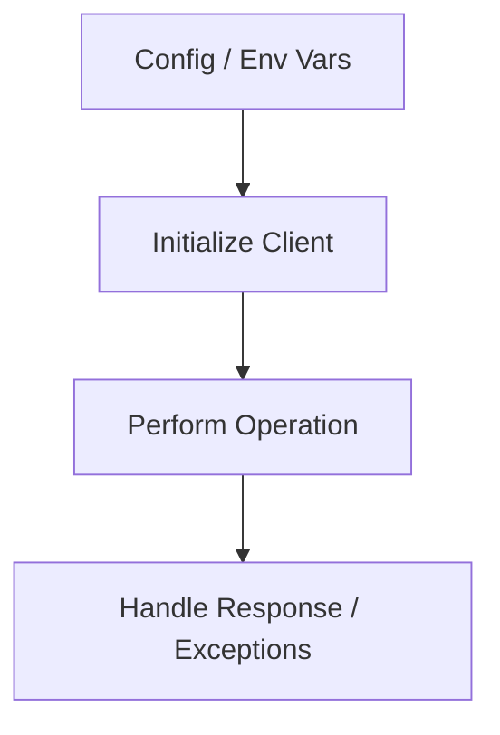

# Python SDK Guide

The Azure Communication Services (ACS) Python SDK provides robust tools for managing identities, sending SMS and emails, and facilitating chat communications.

## SDK Packages

The SDK is modular, allowing you to install only the features you need.

| Feature | Package |
| --- | --- |
| **Identity** | `azure-communication-identity` |
| **SMS** | `azure-communication-sms` |
| **Email** | `azure-communication-email` |
| **Chat** | `azure-communication-chat` |
| **Phone Numbers** | `azure-communication-phonenumbers` |
| **Call Automation** | `azure-communication-callautomation` |

## Prerequisites

- Python 3.8 or later
- An active Azure subscription
- An ACS resource (see [Local Setup](./tutorial/01-local-setup.md))

## Quick Start: Send SMS

```python
from azure.communication.sms import SmsClient

connection_string = "YOUR_CONNECTION_STRING"
sms_client = SmsClient.from_connection_string(connection_string)

response = sms_client.send(
    from_="<registered-phone-number>",
    to=["<recipient-phone-number>"],
    content="Hello from ACS Python SDK!"
)

print(f"Message ID: {response[0].message_id}")
```

## SDK Workflow

The general workflow for ACS Python SDKs involves initializing a client and performing operations using that client.

<!-- diagram-id: python-sdk-workflow -->


## Explore More

- **[Tutorials](./tutorial/index.md)**: Step-by-step guides for common scenarios.
- **[Recipes](./recipes/index.md)**: Focused code snippets for specific tasks.

## See Also

- [Guide home](../../index.md)
- [Start here](../../start-here/overview.md)

## Sources
- [Python SDK Reference](https://learn.microsoft.com/en-us/python/api/overview/azure/communication?view=azure-python)
