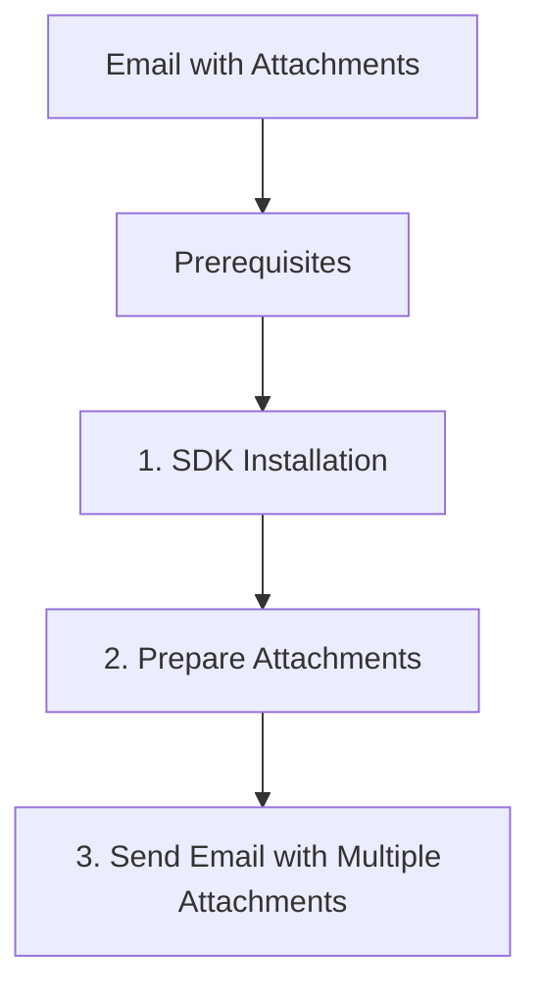

# Email with Attachments

This recipe shows how to send emails with file attachments using Azure Communication Services (ACS) and Python.

## Prerequisites

- Complete the [Send Email Tutorial](../tutorial/03-send-email.md).
- Have a verified domain and sender email address.

## 1. SDK Installation

```bash
pip install azure-communication-email
```

## 2. Prepare Attachments

Attachments must be base64-encoded and include a name and content type.

```python
import base64

def prepare_attachment(file_path, content_type):
    with open(file_path, "rb") as file:
        file_contents = file.read()
        content_bytes = base64.b64encode(file_contents).decode("utf-8")
        
    return {
        "name": os.path.basename(file_path),
        "contentType": content_type,
        "contentInBase64": content_bytes
    }
```

## 3. Send Email with Multiple Attachments

Include the prepared attachments in the `attachments` list of the message.

```python
import os
from azure.communication.email import EmailClient
from azure.identity import DefaultAzureCredential

# Initialize client
endpoint = os.getenv("COMMUNICATION_SERVICES_ENDPOINT")
email_client = EmailClient(endpoint, DefaultAzureCredential())

# Prepare attachments
attachment1 = prepare_attachment("document.pdf", "application/pdf")
attachment2 = prepare_attachment("image.png", "image/png")

# Create email message
message = {
    "content": {
        "subject": "ACS Email with Multiple Attachments",
        "plainText": "See the attached files for your reference."
    },
    "recipients": {
        "to": [{"address": "<recipient-email-address>"}]
    },
    "senderAddress": "<verified-sender-email-address>",
    "attachments": [attachment1, attachment2]
}

# Send email
poller = email_client.begin_send(message)
result = poller.result()
print(f"Message ID: {result['messageId']}")
```

## 4. Attachment Size Limits

ACS has limits on the total size of an email and individual attachments.

- **Total Email Size**: 25 MB (including attachments).
- **Max Attachments**: No strict limit, but bounded by total email size.

!!! warning "Important"
    Base64 encoding increases the size of attachments by approximately 33%. For large files, consider providing a link to a secure storage location (e.g., Azure Blob Storage) instead.

## 5. Multiple Attachment Types

Common content types include:
- `application/pdf`
- `image/png`
- `image/jpeg`
- `text/plain`
- `application/vnd.openxmlformats-officedocument.wordprocessingml.document` (Word doc)

## 6. Best Practices

- Always validate file size before encoding to avoid exceeding limits.
- Use meaningful attachment names.
- Consider compression for large documents.

## Page Flow

<!-- diagram-id: email-with-attachments-page-flow -->


## Review Matrix

| Review area | Page-specific check |
|---|---|
| Scope | Confirm the guidance applies to Email with Attachments. |
| Source basis | Validate the recommendation against the Microsoft Learn sources in this page. |
| Evidence | Capture command output, portal state, metrics, logs, or screenshots before treating the result as proven. |

## See Also
- [ACS Email Concepts](https://learn.microsoft.com/en-us/azure/communication-services/quickstarts/email/send-email-advanced/send-email-with-attachments)
- [Email Troubleshooting](https://learn.microsoft.com/en-us/azure/communication-services/concepts/email/prepare-email-communication-resource)

## Sources
- [Azure Communication Email client library for Python](https://learn.microsoft.com/python/api/overview/azure/communication-email-readme)
