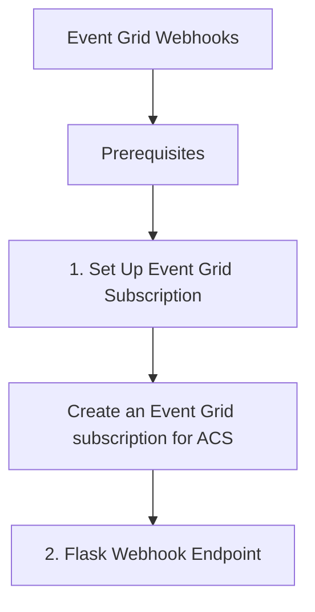

# Event Grid Webhooks

This recipe demonstrates how to set up an Azure Event Grid subscription for Azure Communication Services (ACS) and handle events using a Python web framework like Flask or FastAPI.

## Prerequisites

- [ACS Resource](https://learn.microsoft.com/azure/communication-services/quickstarts/create-communication-resource).
- [Event Grid Subscription](https://learn.microsoft.com/azure/event-grid/overview).
- [Python Web Server](https://flask.palletsprojects.com/) (e.g., Flask, FastAPI).

## 1. Set Up Event Grid Subscription

Use the Azure Portal or CLI to create an Event Grid subscription for your ACS resource.

```bash
# Create an Event Grid subscription for ACS
az eventgrid event-subscription create \
  --name "acs-sms-subscription" \
  --source-resource-id "/subscriptions/<subscription-id>/resourceGroups/<resource-group>/providers/Microsoft.Communication/CommunicationServices/<acs-resource-name>" \
  --endpoint "https://<your-webhook-endpoint>/api/webhooks" \
  --endpoint-type webhook \
  --included-event-types "Microsoft.Communication.SMSReceived" "Microsoft.Communication.SMSDeliveryReportReceived"
```

## 2. Flask Webhook Endpoint

Implement an endpoint to receive and process events. You must handle the `SubscriptionValidationEvent` to successfully register the webhook.

```python
from flask import Flask, request, jsonify

app = Flask(__name__)

@app.route("/api/webhooks", methods=["POST"])
def handle_event():
    # Parse events from the request body
    events = request.json
    
    for event in events:
        # Handle subscription validation event
        if event["eventType"] == "Microsoft.EventGrid.SubscriptionValidationEvent":
            validation_code = event["data"]["validationCode"]
            return jsonify({"validationResponse": validation_code}), 200
            
        # Handle SMS received event
        elif event["eventType"] == "Microsoft.Communication.SMSReceived":
            sender = event["data"]["from"]
            message = event["data"]["message"]
            print(f"Received SMS from {sender}: {message}")
            
        # Handle Email delivered event
        elif event["eventType"] == "Microsoft.Communication.EmailDeliveryReportReceived":
            message_id = event["data"]["messageId"]
            status = event["data"]["status"]
            print(f"Email delivery status for {message_id}: {status}")

    return "OK", 200

if __name__ == "__main__":
    app.run(port=5000)
```

## 3. Validate CloudEvents

For improved interoperability, use the `azure-eventgrid` library to validate and parse CloudEvents.

```bash
pip install azure-eventgrid
```

```python
from azure.eventgrid import EventGridConsumerClient

# Assuming the incoming request is in CloudEvent format
def process_cloud_event(raw_event):
    consumer = EventGridConsumerClient()
    event = consumer.deserialize(raw_event)
    print(f"Processing event of type: {event.event_type}")
```

## 4. Handle Common ACS Events

ACS provides several event types you can subscribe to:

| Event Type | Description |
| --- | --- |
| `Microsoft.Communication.SMSReceived` | Triggered when a message is received at a phone number. |
| `Microsoft.Communication.SMSDeliveryReportReceived` | Triggered when a delivery report is received for an outbound SMS. |
| `Microsoft.Communication.EmailDeliveryReportReceived` | Triggered when a delivery report is received for an email. |
| `Microsoft.Communication.ChatMessageReceived` | Triggered when a new message is sent to a chat thread. |

## Page Flow

<!-- diagram-id: event-grid-webhooks-page-flow -->


## See Also
- [ACS Event Schema](https://learn.microsoft.com/azure/event-grid/event-schema-communication-services)
- [Event Grid Webhook Validation](https://learn.microsoft.com/azure/event-grid/webhook-event-delivery)

## Sources
- [Handle events in Azure Communication Services](https://learn.microsoft.com/en-us/azure/event-grid/event-schema-communication-services)
