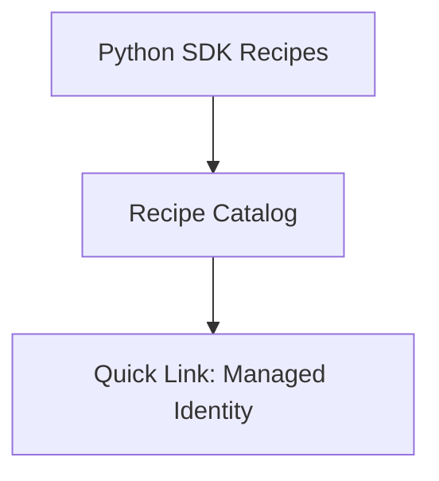

# Python SDK Recipes

This section contains focused code recipes for specific Azure Communication Services (ACS) tasks.

## Recipe Catalog

| Recipe | When to Use |
| --- | --- |
| **[Managed Identity](./managed-identity.md)** | Authenticating with ACS using Azure Managed Identities instead of connection strings. |
| **[Key Vault Reference](./key-vault-reference.md)** | Storing and retrieving ACS connection strings securely from Azure Key Vault. |
| **[Event Grid Webhooks](./event-grid-webhooks.md)** | Handling ACS events (SMS received, Email delivered) using Flask or FastAPI. |
| **[Phone Number Management](./phone-number-management.md)** | Searching, purchasing, and releasing ACS phone numbers. |
| **[Email with Attachments](./email-with-attachments.md)** | Sending emails with multiple file attachments and handling size limits. |
| **[Chat with File Sharing](./chat-with-file-sharing.md)** | Implementing file sharing within ACS chat threads. |
| **[Teams Interop](./teams-interop.md)** | Joining Microsoft Teams meetings and mapping identities between ACS and Teams. |

## Quick Link: Managed Identity

```python
from azure.communication.identity import CommunicationIdentityClient
from azure.identity import DefaultAzureCredential

endpoint = "https://<your-acs-resource-name>.communication.azure.com"
client = CommunicationIdentityClient(endpoint, DefaultAzureCredential())
```

## Page Flow

<!-- diagram-id: index-page-flow -->


## See Also
- [Python SDK Reference](https://learn.microsoft.com/en-us/python/api/overview/azure/communication?view=azure-python)
- [ACS Documentation](https://learn.microsoft.com/azure/communication-services/)

## Sources
- [Azure Communication Services SDK Samples](https://github.com/Azure/azure-sdk-for-python/tree/main/sdk/communication)
