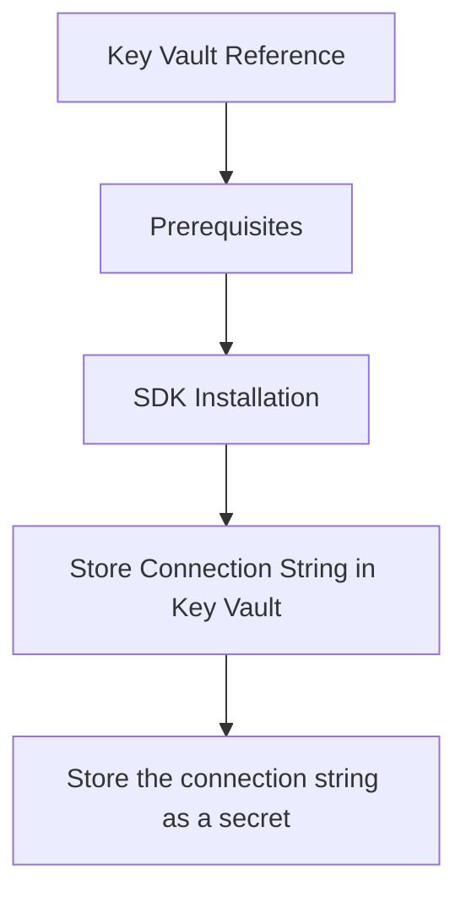

# Key Vault Reference

This recipe shows how to securely store and retrieve Azure Communication Services (ACS) connection strings from Azure Key Vault using Python.

## Prerequisites

- [Azure Key Vault](https://learn.microsoft.com/azure/key-vault/general/overview) resource.
- [ACS Resource](https://learn.microsoft.com/azure/communication-services/quickstarts/create-communication-resource).
- [Managed Identity](https://learn.microsoft.com/azure/active-directory/managed-identities-azure-resources/overview) enabled and configured with access to Key Vault secrets (e.g., **Key Vault Secret User** role).

## SDK Installation

```bash
pip install azure-identity azure-keyvault-secrets
```

## Store Connection String in Key Vault

You can store the ACS connection string as a secret in Key Vault using the Azure CLI or the portal.

```bash
# Store the connection string as a secret
az keyvault secret set --vault-name <your-vault-name> --name "AcsConnectionString" --value "<your-acs-connection-string>"
```

## Access from Python App

The `azure-keyvault-secrets` library provides a client to retrieve secrets from Key Vault.

```python
import os
from azure.identity import DefaultAzureCredential
from azure.keyvault.secrets import SecretClient
from azure.communication.identity import CommunicationIdentityClient

# Key Vault name and secret name
vault_name = os.getenv("KEY_VAULT_NAME")
secret_name = "AcsConnectionString"

# Vault URL
vault_url = f"https://{vault_name}.vault.azure.net"

# Initialize SecretClient with DefaultAzureCredential
credential = DefaultAzureCredential()
secret_client = SecretClient(vault_url=vault_url, credential=credential)

# Retrieve secret
retrieved_secret = secret_client.get_secret(secret_name)
connection_string = retrieved_secret.value

# Initialize ACS client with retrieved connection string
acs_client = CommunicationIdentityClient.from_connection_string(connection_string)

# Perform ACS operations
user = acs_client.create_user()
print(f"Created user using connection string from Key Vault: {user.properties['id']}")
```

## Rotation Strategy

Regularly rotating your secrets is a security best practice. ACS connection strings can be rotated manually or automated using Azure Functions and Event Grid.

1. Generate a new key for your ACS resource.
2. Update the secret in Key Vault with the new connection string.
3. Your application will automatically retrieve the updated secret upon the next restart or if you implement a periodic refresh mechanism.

!!! info "Important"
    Key Vault supports versioning, allowing you to easily roll back if a new key fails.

## Page Flow

<!-- diagram-id: key-vault-reference-page-flow -->


## Review Matrix

| Review area | Page-specific check |
|---|---|
| Scope | Confirm the guidance applies to Key Vault Reference. |
| Source basis | Validate the recommendation against the Microsoft Learn sources in this page. |
| Evidence | Capture command output, portal state, metrics, logs, or screenshots before treating the result as proven. |

## See Also
- [Azure Key Vault Secrets Python Client](https://learn.microsoft.com/python/api/overview/azure/keyvault-secrets-readme)
- [Key Vault Authentication](https://learn.microsoft.com/azure/key-vault/general/authentication)

## Sources
- [Use Azure Key Vault from a Python application](https://learn.microsoft.com/en-us/azure/key-vault/general/quick-create-cli)
