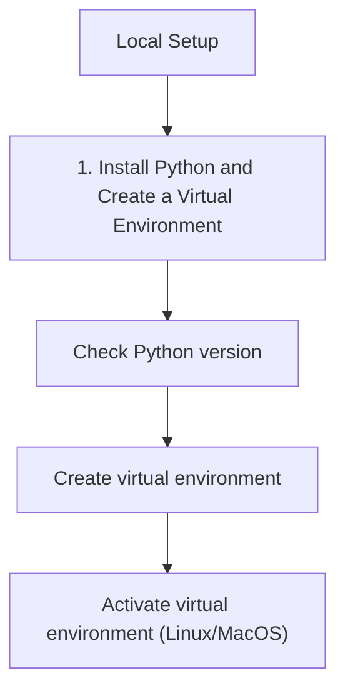

# Local Setup

In this step, we'll configure your local development environment to use the Azure Communication Services (ACS) Python SDK.

## 1. Install Python and Create a Virtual Environment

Ensure you have Python 3.8 or later installed. It's recommended to use a virtual environment to manage dependencies.

```bash
# Check Python version
python --version

# Create virtual environment
python -m venv acs-env

# Activate virtual environment (Linux/MacOS)
source acs-env/bin/activate

# Activate virtual environment (Windows)
# acs-env\Scripts\activate
```

## 2. Install ACS SDK Packages

Install the necessary ACS SDK packages via pip.

```bash
pip install azure-communication-identity azure-communication-sms azure-communication-email azure-communication-chat azure-communication-phonenumbers
```

## 3. Create ACS Resource in Azure

1. Log in to the [Azure Portal](https://portal.azure.com/).
2. Click **Create a resource** and search for **Communication Services**.
3. Fill in the required details:
    - **Resource Group**: Create a new or use an existing one.
    - **Resource Name**: Choose a unique name.
    - **Data Location**: Select a location near you.
4. Click **Review + create** and then **Create**.

## 4. Get Connection String

1. Once the resource is deployed, navigate to it in the Azure Portal.
2. Under **Settings**, select **Keys**.
3. Copy the **Connection string** for the primary key.

## 5. Set Up Environment Variables

It's best practice to store sensitive information in environment variables.

```bash
# Linux/MacOS
export COMMUNICATION_SERVICES_CONNECTION_STRING="<your-connection-string>"

# Windows
# setx COMMUNICATION_SERVICES_CONNECTION_STRING "<your-connection-string>"
```

## 6. Verify with Simple Identity Token Creation

Create a file named `identity_token.py` and add the following code to verify your setup.

```python
import os
from azure.communication.identity import CommunicationIdentityClient

def main():
    try:
        connection_string = os.getenv("COMMUNICATION_SERVICES_CONNECTION_STRING")
        if not connection_string:
            print("Please set the COMMUNICATION_SERVICES_CONNECTION_STRING environment variable.")
            return

        # Initialize the client
        client = CommunicationIdentityClient.from_connection_string(connection_string)

        # Create a new user identity
        user = client.create_user()
        print(f"Created a new user identity: {user.properties['id']}")

        # Issue an access token for the user with 'chat' and 'voip' scopes
        token_result = client.get_token(user, ["chat", "voip"])
        print(f"Issued an access token: {token_result.token}")
        print(f"Token expires at: {token_result.expires_on}")

    except Exception as ex:
        print(f"An error occurred: {ex}")

if __name__ == "__main__":
    main()
```

Run the script to verify your connection:

```bash
python identity_token.py
```

## Page Flow

<!-- diagram-id: 01-local-setup-page-flow -->


## Review Matrix

| Review area | Page-specific check |
|---|---|
| Scope | Confirm the guidance applies to Local Setup. |
| Source basis | Validate the recommendation against the Microsoft Learn sources in this page. |
| Evidence | Capture command output, portal state, metrics, logs, or screenshots before treating the result as proven. |

## See Also
- [Create and manage ACS resources](https://learn.microsoft.com/azure/communication-services/quickstarts/create-communication-resource)
- [Manage user access tokens](https://learn.microsoft.com/en-us/azure/communication-services/quickstarts/identity/access-tokens)

## Sources
- [Azure Communication Identity client library for Python](https://learn.microsoft.com/python/api/overview/azure/communication-identity-readme)
