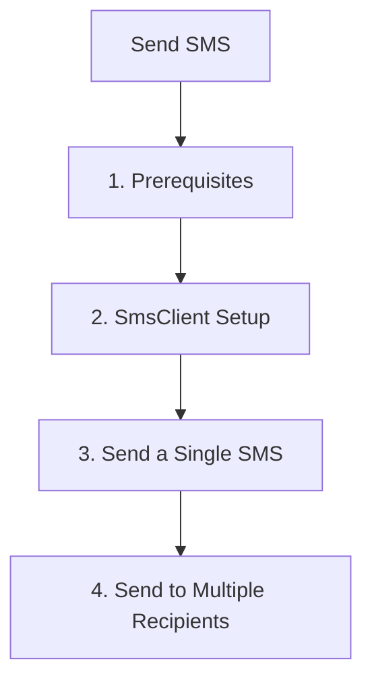

# Send SMS

This step demonstrates how to use the Azure Communication Services (ACS) Python SDK to send SMS messages.

## 1. Prerequisites

- Complete the [Local Setup](./01-local-setup.md).
- Have a registered phone number in your ACS resource.

## 2. SmsClient Setup

Initialize the `SmsClient` using the connection string from your environment variables.

```python
import os
from azure.communication.sms import SmsClient

connection_string = os.getenv("COMMUNICATION_SERVICES_CONNECTION_STRING")
sms_client = SmsClient.from_connection_string(connection_string)
```

## 3. Send a Single SMS

To send a message, provide the sender's phone number, the recipient's phone number, and the message content.

```python
sms_responses = sms_client.send(
    from_="<registered-phone-number>",
    to=["<recipient-phone-number>"],
    content="Hello from ACS Python SDK!"
)

for response in sms_responses:
    if response.successful:
        print(f"Message sent to {response.to}. Message ID: {response.message_id}")
    else:
        print(f"Failed to send message to {response.to}. Error: {response.error_message}")
```

## 4. Send to Multiple Recipients

The `to` parameter accepts a list of phone numbers, allowing you to send messages in bulk.

```python
recipients = ["<recipient-phone-number-1>", "<recipient-phone-number-2>"]

sms_responses = sms_client.send(
    from_="<registered-phone-number>",
    to=recipients,
    content="Bulk message from ACS Python SDK!"
)

for response in sms_responses:
    print(f"Status for {response.to}: {'Success' if response.successful else 'Failure'}")
```

## 5. Delivery Report Handling

ACS provides delivery reports via Event Grid. While the SDK itself doesn't "handle" the report, it provides the `message_id` you'll need to correlate reports.

!!! info "Important"
    Delivery reports are typically handled via webhooks or Event Grid subscriptions. See the [Event Grid Webhooks Recipe](../recipes/event-grid-webhooks.md) for more.

## 6. Error Handling Patterns

It's essential to handle potential exceptions, such as network issues or invalid phone numbers.

```python
try:
    sms_responses = sms_client.send(
        from_="<registered-phone-number>",
        to=["<recipient-phone-number>"],
        content="Testing error handling."
    )
except Exception as ex:
    print(f"An error occurred while sending SMS: {ex}")
```

## Full Code Example

Create a file named `send_sms.py` with the following content:

```python
import os
from azure.communication.sms import SmsClient

def send_sms():
    try:
        # Retrieve connection string from environment variable
        connection_string = os.getenv("COMMUNICATION_SERVICES_CONNECTION_STRING")
        if not connection_string:
            print("Please set the COMMUNICATION_SERVICES_CONNECTION_STRING environment variable.")
            return

        # Initialize the SmsClient
        sms_client = SmsClient.from_connection_string(connection_string)

        # Send a message
        # Replace with your registered number and recipient number
        from_number = "<registered-phone-number>"
        to_numbers = ["<recipient-phone-number>"]
        
        sms_responses = sms_client.send(
            from_=from_number,
            to=to_numbers,
            content="Hello from ACS Python SDK tutorial!"
        )

        for response in sms_responses:
            if response.successful:
                print(f"Message ID: {response.message_id}")
            else:
                print(f"Error: {response.error_message}")

    except Exception as ex:
        print(f"Exception: {ex}")

if __name__ == "__main__":
    send_sms()
```

## Page Flow

<!-- diagram-id: 02-send-sms-page-flow -->


## Review Matrix

| Review area | Page-specific check |
|---|---|
| Scope | Confirm the guidance applies to Send SMS. |
| Source basis | Validate the recommendation against the Microsoft Learn sources in this page. |
| Evidence | Capture command output, portal state, metrics, logs, or screenshots before treating the result as proven. |

## See Also
- [SMS Troubleshooting](https://learn.microsoft.com/en-us/azure/communication-services/concepts/sms/concepts)
- [SMS Delivery Reports](https://learn.microsoft.com/en-us/azure/communication-services/concepts/sms/concepts)

## Sources
- [Azure Communication SMS client library for Python](https://learn.microsoft.com/python/api/overview/azure/communication-sms-readme)
