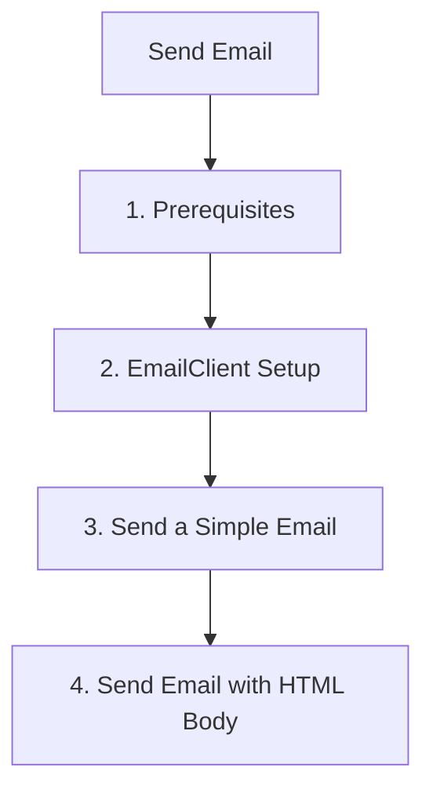

# Send Email

This step demonstrates how to use the Azure Communication Services (ACS) Python SDK to send emails.

## 1. Prerequisites

- Complete the [Local Setup](./01-local-setup.md).
- Have a verified domain in your ACS resource.

## 2. EmailClient Setup

Initialize the `EmailClient` using the connection string.

```python
import os
from azure.communication.email import EmailClient

connection_string = os.getenv("COMMUNICATION_SERVICES_CONNECTION_STRING")
email_client = EmailClient.from_connection_string(connection_string)
```

## 3. Send a Simple Email

Provide the sender's email address, recipient's email address, subject, and message content.

```python
message = {
    "content": {
        "subject": "Hello from ACS Email SDK!",
        "plainText": "This is a plain text email message sent with ACS Python SDK."
    },
    "recipients": {
        "to": [{"address": "<recipient-email-address>"}]
    },
    "senderAddress": "<verified-sender-email-address>"
}

poller = email_client.begin_send(message)
result = poller.result()
print(f"Message ID: {result['messageId']}")
```

## 4. Send Email with HTML Body

You can send HTML-formatted emails by providing the `html` content.

```python
message = {
    "content": {
        "subject": "HTML Email from ACS Email SDK!",
        "html": "<html><body><h1>Hello!</h1><p>This is an HTML email sent with ACS Python SDK.</p></body></html>"
    },
    "recipients": {
        "to": [{"address": "<recipient-email-address>"}]
    },
    "senderAddress": "<verified-sender-email-address>"
}

poller = email_client.begin_send(message)
result = poller.result()
print(f"Message ID: {result['messageId']}")
```

## 5. Send with Attachments

To send an email with attachments, provide the `attachments` list in the message dictionary.

```python
import base64

with open("sample.txt", "rb") as file:
    file_contents = file.read()
    content_bytes = base64.b64encode(file_contents).decode("utf-8")

message = {
    "content": {
        "subject": "Email with Attachment from ACS Email SDK!",
        "plainText": "This email contains an attachment."
    },
    "recipients": {
        "to": [{"address": "<recipient-email-address>"}]
    },
    "senderAddress": "<verified-sender-email-address>",
    "attachments": [
        {
            "name": "sample.txt",
            "contentType": "text/plain",
            "contentInBase64": content_bytes
        }
    ]
}

poller = email_client.begin_send(message)
result = poller.result()
print(f"Message ID: {result['messageId']}")
```

## 6. Poll for Delivery Status

The `begin_send` method returns a poller object that you can use to check the status of the email delivery.

```python
poller = email_client.begin_send(message)
while not poller.done():
    print(f"Polling status: {poller.status()}")
    poller.wait(2)

result = poller.result()
print(f"Status of email send: {result['status']}")
```

## Full Code Example

Create a file named `send_email.py` with the following content:

```python
import os
from azure.communication.email import EmailClient

def send_email():
    try:
        connection_string = os.getenv("COMMUNICATION_SERVICES_CONNECTION_STRING")
        if not connection_string:
            print("Please set the COMMUNICATION_SERVICES_CONNECTION_STRING environment variable.")
            return

        email_client = EmailClient.from_connection_string(connection_string)

        message = {
            "content": {
                "subject": "Hello from ACS Email SDK tutorial!",
                "plainText": "This is a message sent from the ACS Python SDK tutorial."
            },
            "recipients": {
                "to": [{"address": "<recipient-email-address>"}]
            },
            "senderAddress": "<verified-sender-email-address>"
        }

        poller = email_client.begin_send(message)
        result = poller.result()
        print(f"Message ID: {result['messageId']}")

    except Exception as ex:
        print(f"Exception: {ex}")

if __name__ == "__main__":
    send_email()
```

## Verified Test Results (April 2026)

!!! success "Verified: All Tests Passed"
    These results were obtained from actual Azure Communication Services testing on April 14, 2026.

### Test Environment
- **ACS Resource**: `acs-email-lab` (Korea data location)
- **Email Service**: `ecs-email-lab`
- **Domain**: `fc135b5e-3353-4c89-9edb-55b53b59215f.azurecomm.net` (Azure Managed, all verifications passed)
- **Sender**: `DoNotReply@fc135b5e-3353-4c89-9edb-55b53b59215f.azurecomm.net`
- **Recipient**: Gmail (`gmail-smtp-in.l.google.com`)
- **Python SDK**: `azure-communication-email==1.1.0`

### Test Results (2026-04-14 11:20 KST)

| Test | Result | Message ID | Timestamp |
|---|---|---|---|
| Single plain text email | ✅ Success | `ec61511c-95a3-4587-8697-fc4663f396c4` | 11:20:01 |
| CC recipient email | ✅ Success | `950742ee-ea1e-4ee5-bb19-6fc19e3cb87b` | 11:20:13 |
| File attachment email (text/plain base64) | ✅ Success | `f83d14a1-4293-460f-b066-c084370f30a5` | 11:20:49 |
| Rich HTML email (styled heading, list) | ✅ Success | `bfa11d8b-9f5d-480a-912b-16dbbe05d0da` | 11:21:05 |
| Parallel burst (5 concurrent emails) | ✅ 5/5 Success | 4a4a, fcbc, 6569, d930, eb34 | ~8.4s total |

### Delivery Confirmation (Log Analytics)
The following insights were verified via Azure Monitor Log Analytics:

- All 9 emails reached `Delivered` status.
- The recipient mail server `gmail-smtp-in.l.google.com` accepted all messages without bounces or failures.
- The average message lifecycle (from submission to `OutForDelivery`) was measured between 3 and 6 seconds per message.

## Page Flow

<!-- diagram-id: 03-send-email-page-flow -->


## See Also
- [Email Troubleshooting](https://learn.microsoft.com/en-us/azure/communication-services/concepts/email/prepare-email-communication-resource)
- [Email Delivery Reports](https://learn.microsoft.com/en-us/azure/communication-services/concepts/email/prepare-email-communication-resource)

## Sources
- [Azure Communication Email client library for Python](https://learn.microsoft.com/python/api/overview/azure/communication-email-readme)
