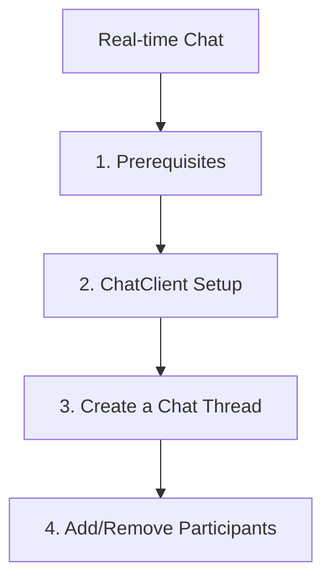

# Real-time Chat

This step demonstrates how to build real-time chat features using the Azure Communication Services (ACS) Python SDK.

## 1. Prerequisites

- Complete the [Local Setup](./01-local-setup.md).
- Have an ACS user identity and access token with 'chat' scope.

## 2. ChatClient Setup

Initialize the `ChatClient` using the ACS endpoint and an access token.

```python
import os
from azure.communication.chat import ChatClient
from azure.core.credentials import AzureKeyCredential

endpoint = os.getenv("COMMUNICATION_SERVICES_ENDPOINT")
token = "<access-token>"
chat_client = ChatClient(endpoint, AzureKeyCredential(token))
```

## 3. Create a Chat Thread

A chat thread is where messages are exchanged between participants.

```python
topic = "Team Discussion"
create_chat_thread_result = chat_client.create_chat_thread(topic)
chat_thread_client = chat_client.get_chat_thread_client(create_chat_thread_result.chat_thread.id)

print(f"Created chat thread with ID: {chat_thread_client.thread_id}")
```

## 4. Add/Remove Participants

You can add or remove participants from a chat thread.

```python
from azure.communication.chat import ChatParticipant

new_participant = ChatParticipant(
    identifier="<participant-id>",
    display_name="Jane Doe"
)

chat_thread_client.add_participants([new_participant])
print(f"Added participant: {new_participant.display_name}")

# Remove a participant
# chat_thread_client.remove_participant(identifier="<participant-id>")
```

## 5. Send Messages

Use the `ChatThreadClient` to send messages to the thread.

```python
send_message_result = chat_thread_client.send_message(
    content="Hello everyone! Welcome to the chat.",
    sender_display_name="John Doe"
)

print(f"Message sent! ID: {send_message_result.id}")
```

## 6. Receive Messages

You can retrieve a list of messages from a chat thread.

```python
chat_messages = chat_thread_client.list_messages()

for message in chat_messages:
    if message.type == 'text':
        print(f"{message.sender_display_name}: {message.content.message}")
```

## 7. Real-time Notifications Setup

To receive real-time notifications, you typically use a signaling service (like WebSockets or SignalR). While the Python SDK doesn't provide a direct signaling client (this is usually handled by a frontend application), you can configure webhooks or Event Grid subscriptions to handle chat events on the server side.

!!! tip "Tip"
    For client-side real-time notifications, use the [JavaScript SDK Guide](../../javascript/tutorial/04-chat.md).

## Full Code Example

Create a file named `chat_operations.py` with the following content:

```python
import os
from azure.communication.chat import ChatClient, ChatParticipant
from azure.communication.identity import CommunicationIdentityClient

def chat_demo():
    try:
        connection_string = os.getenv("COMMUNICATION_SERVICES_CONNECTION_STRING")
        endpoint = os.getenv("COMMUNICATION_SERVICES_ENDPOINT")

        # Create identity client
        identity_client = CommunicationIdentityClient.from_connection_string(connection_string)

        # Create users
        user1 = identity_client.create_user()
        user2 = identity_client.create_user()

        # Get token for user1
        token_response = identity_client.get_token(user1, ["chat"])

        # Initialize chat client for user1
        chat_client = ChatClient(endpoint, token_response.token)

        # Create thread
        topic = "Tutorial Chat"
        create_result = chat_client.create_chat_thread(topic)
        thread_id = create_result.chat_thread.id
        thread_client = chat_client.get_chat_thread_client(thread_id)

        # Add user2 to thread
        participant2 = ChatParticipant(identifier=user2, display_name="Alice")
        thread_client.add_participants([participant2])

        # Send message
        thread_client.send_message(content="Hi Alice!", sender_display_name="Bob")

        # List messages
        messages = thread_client.list_messages()
        for m in messages:
            if m.type == 'text':
                print(f"[{m.created_on}] {m.sender_display_name}: {m.content.message}")

    except Exception as ex:
        print(f"Exception: {ex}")

if __name__ == "__main__":
    chat_demo()
```

## Page Flow

<!-- diagram-id: 04-chat-page-flow -->


## Review Matrix

| Review area | Page-specific check |
|---|---|
| Scope | Confirm the guidance applies to Real-time Chat. |
| Source basis | Validate the recommendation against the Microsoft Learn sources in this page. |
| Evidence | Capture command output, portal state, metrics, logs, or screenshots before treating the result as proven. |

## See Also
- [Chat Concepts](https://learn.microsoft.com/azure/communication-services/concepts/chat/concepts)
- [Chat SDK Troubleshooting](https://learn.microsoft.com/en-us/azure/communication-services/quickstarts/chat/get-started)

## Sources
- [Azure Communication Chat client library for Python](https://learn.microsoft.com/python/api/overview/azure/communication-chat-readme)
