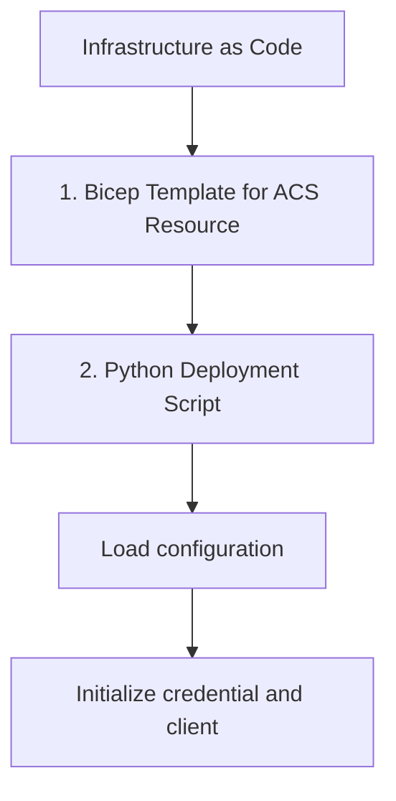

# Infrastructure as Code

This step shows how to use Bicep and Python scripts to deploy and manage Azure Communication Services (ACS) resources.

## 1. Bicep Template for ACS Resource

Create a file named `acs-resource.bicep` with the following content.

```bicep
param communicationServicesName string = 'acs-tutorial-resource'
param dataLocation string = 'United States'

resource communicationService 'Microsoft.Communication/CommunicationServices@2023-03-31' = {
  name: communicationServicesName
  location: 'global'
  properties: {
    dataLocation: dataLocation
  }
}

output acsResourceId string = communicationService.id
```

## 2. Python Deployment Script

Use the `azure-mgmt-resource` and `azure-identity` Python packages to deploy the Bicep template.

```bash
pip install azure-mgmt-resource azure-identity
```

```python
import os
from azure.identity import DefaultAzureCredential
from azure.mgmt.resource import ResourceManagementClient
from azure.mgmt.resource.resources.models import DeploymentMode

# Load configuration
subscription_id = os.getenv("AZURE_SUBSCRIPTION_ID")
resource_group_name = "acs-tutorial-rg"
deployment_name = "acs-deployment"

# Initialize credential and client
credential = DefaultAzureCredential()
resource_client = ResourceManagementClient(credential, subscription_id)

# Load Bicep file (compiled to JSON or use Bicep CLI to compile)
# For this example, assume a JSON-compiled template
with open("acs-resource.json", "r") as f:
    template_json = f.read()

# Deploy the template
deployment_properties = {
    'mode': DeploymentMode.INCREMENTAL,
    'template': template_json,
    'parameters': {
        'communicationServicesName': {'value': 'acs-python-tutorial'}
    }
}

result = resource_client.deployments.begin_create_or_update(
    resource_group_name,
    deployment_name,
    {'properties': deployment_properties}
)

deployment_result = result.result()
print(f"Deployment result: {deployment_result.properties.provisioning_state}")
```

## 3. Phone Number Provisioning

You can automate phone number search and purchase using the `azure-communication-phonenumbers` SDK.

```python
from azure.communication.phonenumbers import PhoneNumbersClient
from azure.identity import DefaultAzureCredential

endpoint = "https://<your-acs-resource-name>.communication.azure.com"
client = PhoneNumbersClient(endpoint, DefaultAzureCredential())

# Search for available phone numbers
search_poller = client.begin_search_available_phone_numbers(
    area_code="425",
    country_code="US",
    phone_number_type="geographic",
    assignment_type="person",
    capabilities={"sms": "inbound+outbound", "calling": "none"},
    quantity=1
)

search_result = search_poller.result()
print(f"Found phone number: {search_result.phone_numbers[0]}")

# Purchase the phone number (uncomment carefully)
# purchase_poller = client.begin_purchase_phone_numbers(search_result.search_id)
# purchase_poller.result()
# print("Phone number purchased successfully!")
```

## 4. Email Domain Configuration via IaC

While advanced configuration (like domain verification) typically requires manual DNS updates, you can create the email service and domain resources via Bicep.

```bicep
resource emailService 'Microsoft.Communication/EmailServices@2023-03-31' = {
  name: 'email-service-tutorial'
  location: 'global'
  properties: {
    dataLocation: 'United States'
  }
}

resource domain 'Microsoft.Communication/EmailServices/Domains@2023-03-31' = {
  parent: emailService
  name: 'AzureManagedDomain'
  location: 'global'
  properties: {
    domainManagement: 'AzureManaged'
  }
}
```

## 5. CI/CD Integration

Integrate these scripts into your CI/CD pipeline (e.g., GitHub Actions, Azure DevOps) to automate the deployment and management of your ACS infrastructure.

```yaml
# Sample GitHub Action snippet
steps:
- name: Azure Login
  uses: azure/login@v1
  with:
    creds: ${{ secrets.AZURE_CREDENTIALS }}

- name: Deploy ACS with Bicep
  run: |
    az deployment group create --resource-group acs-tutorial-rg --template-file acs-resource.bicep
```

## Page Flow

<!-- diagram-id: 07-infrastructure-as-code-page-flow -->


## Review Matrix

| Review area | Page-specific check |
|---|---|
| Scope | Confirm the guidance applies to Infrastructure as Code. |
| Source basis | Validate the recommendation against the Microsoft Learn sources in this page. |
| Evidence | Capture command output, portal state, metrics, logs, or screenshots before treating the result as proven. |

## See Also
- [Bicep Documentation](https://learn.microsoft.com/azure/azure-resource-manager/bicep/overview)
- [ACS ARM Templates](https://learn.microsoft.com/azure/communication-services/quickstarts/create-communication-resource?tabs=arm-template)

## Sources
- [Infrastructure as Code with Azure Bicep](https://learn.microsoft.com/azure/communication-services/quickstarts/create-communication-resource?tabs=bicep)
